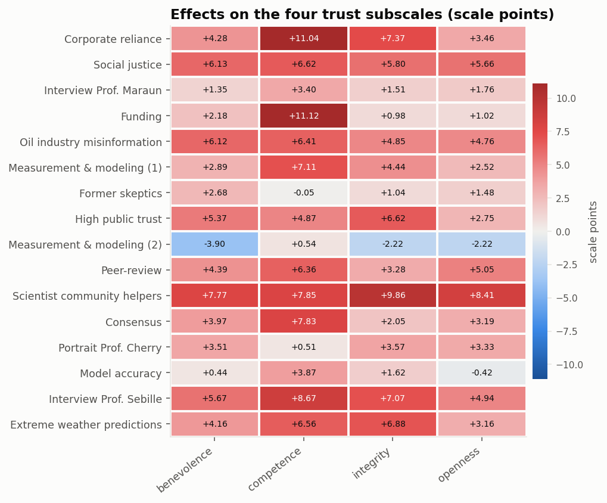

# Intervention effects

[← main report](README.md) · sub-report 1 of 4

Every intervention is compared against the shared control condition. One OLS per
outcome with condition dummy-coded (control as reference) and HC1 robust standard
errors gives all 16 contrasts at once. There are 208 effects in total
(16 interventions x 13 outcomes), so p-values are reported raw and adjusted
(Holm and Benjamini-Hochberg).

## Primary outcome

`trust_multidimensional` is the mean of the four trust subscales (competence, integrity,
benevolence, openness), each the mean of three 0-100 slider items.

Control mean: **53.38**.
Largest positive effect: **Scientist community helpers** (+8.47 points,
95% CI [6.80, 10.14]).
Largest negative effect: **Measurement & modeling (2)** (-1.95 points).
57 of 208 effects across all outcomes survive Holm correction at 0.05.

| condition | n_treated | treated_mean | estimate | se | conf_low | conf_high | cohens_d | p | p_holm |
| --- | --- | --- | --- | --- | --- | --- | --- | --- | --- |
| Scientist community helpers | 1000 | 61.854 | 8.471 | 0.853 | 6.799 | 10.143 | 0.387 | 0.000 | 0.000 |
| Interview Prof. Sebille | 1000 | 59.973 | 6.590 | 0.871 | 4.882 | 8.298 | 0.298 | 0.000 | 0.000 |
| Corporate reliance | 1000 | 59.922 | 6.539 | 0.839 | 4.895 | 8.184 | 0.301 | 0.000 | 0.000 |
| Social justice | 1000 | 59.434 | 6.051 | 0.885 | 4.316 | 7.787 | 0.271 | 0.000 | 0.000 |
| Oil industry misinformation | 1000 | 58.920 | 5.538 | 0.857 | 3.857 | 7.218 | 0.252 | 0.000 | 0.000 |
| Extreme weather predictions | 1000 | 58.575 | 5.192 | 0.826 | 3.572 | 6.812 | 0.241 | 0.000 | 0.000 |
| High public trust | 1000 | 58.285 | 4.903 | 0.844 | 3.248 | 6.557 | 0.225 | 0.000 | 0.000 |
| Peer-review | 1000 | 58.152 | 4.769 | 0.868 | 3.068 | 6.470 | 0.216 | 0.000 | 0.000 |
| Consensus | 1000 | 57.643 | 4.260 | 0.812 | 2.669 | 5.852 | 0.199 | 0.000 | 0.000 |
| Measurement & modeling (1) | 1000 | 57.624 | 4.241 | 0.847 | 2.581 | 5.902 | 0.194 | 0.000 | 0.000 |
| Funding | 1000 | 57.207 | 3.824 | 0.810 | 2.237 | 5.411 | 0.179 | 0.000 | 0.000 |
| Portrait Prof. Cherry | 1000 | 56.109 | 2.727 | 0.861 | 1.038 | 4.415 | 0.124 | 0.002 | 0.217 |
| Interview Prof. Maraun | 1000 | 55.387 | 2.005 | 0.805 | 0.426 | 3.583 | 0.094 | 0.013 | 1.000 |
| Model accuracy | 1000 | 54.760 | 1.377 | 0.812 | -0.214 | 2.968 | 0.064 | 0.090 | 1.000 |
| Former skeptics | 1000 | 54.669 | 1.286 | 0.832 | -0.345 | 2.917 | 0.059 | 0.122 | 1.000 |
| Measurement & modeling (2) | 1000 | 51.432 | -1.951 | 0.850 | -3.617 | -0.285 | -0.089 | 0.022 | 1.000 |

## All outcomes

Effects are shown in percentage points of each outcome's scale range, so that a
move on a 0-100 slider, a dollar of donation and a newsletter signup are on one
footing. This is the unit the benchmark scores on.

## Which outcomes move, and do the messages differ?

The benchmark separates two kinds of skill: knowing *which outcomes* an
intervention can move at all, and knowing *which message* moves them. The second
only means anything where the 16 effects actually spread out. `true_sd_effect_pp`
is the observed spread with the average sampling variance removed, so it
estimates real between-message variation rather than estimation noise.

| outcome | mean_effect_pp | min_effect_pp | max_effect_pp | sd_effect_pp | true_sd_effect_pp | n_positive | n_significant_holm |
| --- | --- | --- | --- | --- | --- | --- | --- |
| trust_multidimensional | 4.114 | -1.951 | 8.471 | 2.553 | 2.410 | 15 | 11 |
| trust_post | 2.351 | -1.187 | 7.824 | 2.433 | 2.167 | 13 | 5 |
| distrust_post | -3.647 | -7.283 | 0.205 | 2.114 | 1.778 | 1 | 7 |
| funding_perceptions | -0.499 | -2.968 | 1.932 | 1.286 | 0.719 | 4 | 0 |
| policy_role_mean | 2.721 | -0.632 | 8.125 | 2.820 | 2.693 | 11 | 7 |
| inst_trust_mean | 2.445 | -0.326 | 4.030 | 1.404 | 1.174 | 14 | 8 |
| belief_post | 2.270 | 0.016 | 3.555 | 0.864 | 0.000 | 16 | 2 |
| concern_mean | 2.003 | -3.223 | 6.411 | 2.243 | 2.076 | 14 | 5 |
| policy_general | 3.030 | -3.464 | 8.957 | 2.978 | 2.777 | 14 | 6 |
| policy_specific_mean | 0.996 | -5.691 | 7.582 | 2.921 | 2.812 | 11 | 4 |
| behavior_mean | 0.883 | -2.556 | 4.718 | 1.709 | 1.513 | 13 | 2 |
| donation_ams | 1.153 | -0.345 | 2.755 | 1.011 | 0.000 | 15 | 0 |
| newsletter_signup | -0.431 | -4.950 | 2.850 | 2.203 | 1.286 | 7 | 0 |

## Trust subscales

## Condition means

| condition | trust_multidimensional | trust_post | distrust_post | funding_perceptions | policy_role_mean | inst_trust_mean | belief_post | concern_mean | policy_general | policy_specific_mean | behavior_mean | donation_ams | newsletter_signup |
| --- | --- | --- | --- | --- | --- | --- | --- | --- | --- | --- | --- | --- | --- |
| Consensus | 57.64 | 58.34 | 39.59 | 44.34 | 68.13 | 58.15 | 85.48 | 67.18 | 68.86 | 60.69 | 45.17 | 3.21 | 0.34 |
| Corporate reliance | 59.92 | 60.56 | 39.25 | 45.26 | 67.56 | 59.57 | 84.84 | 67.85 | 66.99 | 60.28 | 44.47 | 2.99 | 0.30 |
| Extreme weather predictions | 58.57 | 62.20 | 34.73 | 43.59 | 69.13 | 60.34 | 85.26 | 67.51 | 67.39 | 59.80 | 44.10 | 3.14 | 0.31 |
| Former skeptics | 54.67 | 59.04 | 38.67 | 47.40 | 65.50 | 57.99 | 82.84 | 61.82 | 61.17 | 54.18 | 41.86 | 3.18 | 0.32 |
| Funding | 57.21 | 56.91 | 42.10 | 45.14 | 65.25 | 59.01 | 84.18 | 67.48 | 69.12 | 60.49 | 44.87 | 3.00 | 0.33 |
| High public trust | 58.29 | 59.24 | 38.43 | 45.32 | 67.99 | 60.42 | 84.13 | 64.20 | 66.54 | 60.23 | 45.30 | 3.00 | 0.33 |
| Interview Prof. Maraun | 55.39 | 56.38 | 40.03 | 45.57 | 65.11 | 58.10 | 85.03 | 65.35 | 63.83 | 60.01 | 45.11 | 2.96 | 0.26 |
| Interview Prof. Sebille | 59.97 | 62.58 | 36.83 | 43.66 | 72.12 | 60.03 | 85.96 | 69.09 | 69.45 | 64.45 | 47.61 | 3.02 | 0.34 |
| Measurement & modeling (1) | 57.62 | 60.65 | 37.13 | 45.31 | 68.58 | 60.06 | 85.99 | 67.05 | 67.29 | 61.83 | 45.44 | 3.17 | 0.28 |
| Measurement & modeling (2) | 51.43 | 57.07 | 39.73 | 44.80 | 65.37 | 56.06 | 85.16 | 66.08 | 65.38 | 59.65 | 45.35 | 3.27 | 0.29 |
| Model accuracy | 54.76 | 59.28 | 37.17 | 46.38 | 65.13 | 56.20 | 85.08 | 65.73 | 66.22 | 58.53 | 44.49 | 3.05 | 0.30 |
| Oil industry misinformation | 58.92 | 62.19 | 37.09 | 46.93 | 70.60 | 59.96 | 85.78 | 69.06 | 71.67 | 64.07 | 45.97 | 3.02 | 0.28 |
| Peer-review | 58.15 | 61.68 | 36.18 | 45.17 | 69.14 | 57.74 | 85.66 | 66.73 | 68.30 | 60.68 | 45.54 | 3.24 | 0.31 |
| Portrait Prof. Cherry | 56.11 | 58.43 | 40.46 | 44.55 | 69.19 | 58.05 | 84.77 | 66.79 | 66.50 | 59.04 | 43.13 | 3.10 | 0.32 |
| Scientist community helpers | 61.85 | 65.39 | 34.62 | 43.56 | 73.87 | 59.88 | 86.38 | 69.42 | 70.36 | 62.52 | 47.21 | 3.22 | 0.29 |
| Social justice | 59.43 | 58.74 | 40.05 | 42.50 | 72.77 | 59.72 | 85.00 | 71.46 | 73.59 | 67.45 | 49.13 | 3.13 | 0.30 |
| control | 53.38 | 57.57 | 41.90 | 45.46 | 65.74 | 56.39 | 82.83 | 65.05 | 64.64 | 59.87 | 44.41 | 2.99 | 0.31 |

## Full effect table

| outcome | condition | estimate | se | conf_low | conf_high | pp_scale | cohens_d | p | p_holm | p_bh |
| --- | --- | --- | --- | --- | --- | --- | --- | --- | --- | --- |
| trust_multidimensional | Consensus | 4.260 | 0.812 | 2.669 | 5.852 | 4.260 | 0.199 | 0.000 | 0.000 | 0.000 |
| trust_multidimensional | Corporate reliance | 6.539 | 0.839 | 4.895 | 8.184 | 6.539 | 0.301 | 0.000 | 0.000 | 0.000 |
| trust_multidimensional | Extreme weather predictions | 5.192 | 0.826 | 3.572 | 6.812 | 5.192 | 0.241 | 0.000 | 0.000 | 0.000 |
| trust_multidimensional | Former skeptics | 1.286 | 0.832 | -0.345 | 2.917 | 1.286 | 0.059 | 0.122 | 1.000 | 0.203 |
| trust_multidimensional | Funding | 3.824 | 0.810 | 2.237 | 5.411 | 3.824 | 0.179 | 0.000 | 0.000 | 0.000 |
| trust_multidimensional | High public trust | 4.903 | 0.844 | 3.248 | 6.557 | 4.903 | 0.225 | 0.000 | 0.000 | 0.000 |
| trust_multidimensional | Interview Prof. Maraun | 2.005 | 0.805 | 0.426 | 3.583 | 2.005 | 0.094 | 0.013 | 1.000 | 0.031 |
| trust_multidimensional | Interview Prof. Sebille | 6.590 | 0.871 | 4.882 | 8.298 | 6.590 | 0.298 | 0.000 | 0.000 | 0.000 |
| trust_multidimensional | Measurement & modeling (1) | 4.241 | 0.847 | 2.581 | 5.902 | 4.241 | 0.194 | 0.000 | 0.000 | 0.000 |
| trust_multidimensional | Measurement & modeling (2) | -1.951 | 0.850 | -3.617 | -0.285 | -1.951 | -0.089 | 0.022 | 1.000 | 0.049 |
| trust_multidimensional | Model accuracy | 1.377 | 0.812 | -0.214 | 2.968 | 1.377 | 0.064 | 0.090 | 1.000 | 0.161 |
| trust_multidimensional | Oil industry misinformation | 5.538 | 0.857 | 3.857 | 7.218 | 5.538 | 0.252 | 0.000 | 0.000 | 0.000 |
| trust_multidimensional | Peer-review | 4.769 | 0.868 | 3.068 | 6.470 | 4.769 | 0.216 | 0.000 | 0.000 | 0.000 |
| trust_multidimensional | Portrait Prof. Cherry | 2.727 | 0.861 | 1.038 | 4.415 | 2.727 | 0.124 | 0.002 | 0.217 | 0.005 |
| trust_multidimensional | Scientist community helpers | 8.471 | 0.853 | 6.799 | 10.143 | 8.471 | 0.387 | 0.000 | 0.000 | 0.000 |
| trust_multidimensional | Social justice | 6.051 | 0.885 | 4.316 | 7.787 | 6.051 | 0.271 | 0.000 | 0.000 | 0.000 |
| trust_post | Consensus | 0.775 | 1.110 | -1.401 | 2.951 | 0.775 | 0.027 | 0.485 | 1.000 | 0.601 |
| trust_post | Corporate reliance | 2.995 | 1.108 | 0.822 | 5.168 | 2.995 | 0.104 | 0.007 | 0.895 | 0.018 |
| trust_post | Extreme weather predictions | 4.634 | 1.084 | 2.509 | 6.759 | 4.634 | 0.163 | 0.000 | 0.003 | 0.000 |
| trust_post | Former skeptics | 1.471 | 1.096 | -0.678 | 3.620 | 1.471 | 0.051 | 0.180 | 1.000 | 0.277 |
| trust_post | Funding | -0.655 | 1.110 | -2.830 | 1.520 | -0.655 | -0.023 | 0.555 | 1.000 | 0.661 |
| trust_post | High public trust | 1.671 | 1.088 | -0.461 | 3.803 | 1.671 | 0.059 | 0.124 | 1.000 | 0.205 |
| trust_post | Interview Prof. Maraun | -1.187 | 1.112 | -3.367 | 0.993 | -1.187 | -0.041 | 0.286 | 1.000 | 0.413 |
| trust_post | Interview Prof. Sebille | 5.010 | 1.092 | 2.870 | 7.150 | 5.010 | 0.175 | 0.000 | 0.001 | 0.000 |
| trust_post | Measurement & modeling (1) | 3.084 | 1.098 | 0.931 | 5.237 | 3.084 | 0.108 | 0.005 | 0.655 | 0.013 |
| trust_post | Measurement & modeling (2) | -0.493 | 1.137 | -2.721 | 1.735 | -0.493 | -0.017 | 0.664 | 1.000 | 0.763 |
| trust_post | Model accuracy | 1.715 | 1.110 | -0.460 | 3.890 | 1.715 | 0.060 | 0.122 | 1.000 | 0.203 |
| trust_post | Oil industry misinformation | 4.622 | 1.102 | 2.462 | 6.782 | 4.622 | 0.161 | 0.000 | 0.005 | 0.000 |
| trust_post | Peer-review | 4.110 | 1.119 | 1.917 | 6.303 | 4.110 | 0.142 | 0.000 | 0.037 | 0.001 |
| trust_post | Portrait Prof. Cherry | 0.865 | 1.113 | -1.317 | 3.047 | 0.865 | 0.030 | 0.437 | 1.000 | 0.561 |
| trust_post | Scientist community helpers | 7.824 | 1.085 | 5.698 | 9.950 | 7.824 | 0.275 | 0.000 | 0.000 | 0.000 |
| trust_post | Social justice | 1.174 | 1.135 | -1.050 | 3.398 | 1.174 | 0.040 | 0.301 | 1.000 | 0.420 |
| distrust_post | Consensus | -2.315 | 1.147 | -4.562 | -0.068 | -2.315 | -0.077 | 0.043 | 1.000 | 0.088 |
| distrust_post | Corporate reliance | -2.646 | 1.170 | -4.940 | -0.352 | -2.646 | -0.088 | 0.024 | 1.000 | 0.053 |
| distrust_post | Extreme weather predictions | -7.171 | 1.106 | -9.339 | -5.003 | -7.171 | -0.244 | 0.000 | 0.000 | 0.000 |
| distrust_post | Former skeptics | -3.234 | 1.126 | -5.442 | -1.026 | -3.234 | -0.109 | 0.004 | 0.552 | 0.012 |
| distrust_post | Funding | 0.205 | 1.159 | -2.066 | 2.476 | 0.205 | 0.007 | 0.860 | 1.000 | 0.912 |
| distrust_post | High public trust | -3.474 | 1.116 | -5.662 | -1.286 | -3.474 | -0.118 | 0.002 | 0.258 | 0.006 |
| distrust_post | Interview Prof. Maraun | -1.867 | 1.138 | -4.097 | 0.363 | -1.867 | -0.063 | 0.101 | 1.000 | 0.176 |
| distrust_post | Interview Prof. Sebille | -5.068 | 1.123 | -7.269 | -2.867 | -5.068 | -0.171 | 0.000 | 0.001 | 0.000 |
| distrust_post | Measurement & modeling (1) | -4.768 | 1.131 | -6.985 | -2.551 | -4.768 | -0.160 | 0.000 | 0.004 | 0.000 |
| distrust_post | Measurement & modeling (2) | -2.170 | 1.152 | -4.427 | 0.087 | -2.170 | -0.072 | 0.060 | 1.000 | 0.116 |
| distrust_post | Model accuracy | -4.728 | 1.131 | -6.945 | -2.511 | -4.728 | -0.159 | 0.000 | 0.005 | 0.000 |
| distrust_post | Oil industry misinformation | -4.814 | 1.133 | -7.035 | -2.593 | -4.814 | -0.162 | 0.000 | 0.004 | 0.000 |
| distrust_post | Peer-review | -5.724 | 1.138 | -7.955 | -3.493 | -5.724 | -0.192 | 0.000 | 0.000 | 0.000 |
| distrust_post | Portrait Prof. Cherry | -1.443 | 1.171 | -3.738 | 0.852 | -1.443 | -0.048 | 0.218 | 1.000 | 0.328 |
| distrust_post | Scientist community helpers | -7.283 | 1.162 | -9.560 | -5.006 | -7.283 | -0.242 | 0.000 | 0.000 | 0.000 |
| distrust_post | Social justice | -1.845 | 1.179 | -4.156 | 0.466 | -1.845 | -0.061 | 0.118 | 1.000 | 0.199 |
| funding_perceptions | Consensus | -1.126 | 1.069 | -3.222 | 0.969 | -1.126 | -0.041 | 0.292 | 1.000 | 0.417 |
| funding_perceptions | Corporate reliance | -0.200 | 1.071 | -2.300 | 1.899 | -0.200 | -0.007 | 0.852 | 1.000 | 0.912 |
| funding_perceptions | Extreme weather predictions | -1.880 | 1.080 | -3.997 | 0.238 | -1.880 | -0.068 | 0.082 | 1.000 | 0.152 |
| funding_perceptions | Former skeptics | 1.932 | 1.036 | -0.098 | 3.961 | 1.932 | 0.071 | 0.062 | 1.000 | 0.120 |
| funding_perceptions | Funding | -0.327 | 1.046 | -2.377 | 1.722 | -0.327 | -0.012 | 0.754 | 1.000 | 0.843 |
| funding_perceptions | High public trust | -0.144 | 1.050 | -2.202 | 1.913 | -0.144 | -0.005 | 0.891 | 1.000 | 0.931 |
| funding_perceptions | Interview Prof. Maraun | 0.104 | 1.057 | -1.968 | 2.175 | 0.104 | 0.004 | 0.922 | 1.000 | 0.956 |
| funding_perceptions | Interview Prof. Sebille | -1.809 | 1.076 | -3.918 | 0.299 | -1.809 | -0.065 | 0.093 | 1.000 | 0.165 |
| funding_perceptions | Measurement & modeling (1) | -0.156 | 1.082 | -2.277 | 1.964 | -0.156 | -0.006 | 0.885 | 1.000 | 0.931 |
| funding_perceptions | Measurement & modeling (2) | -0.665 | 1.082 | -2.786 | 1.455 | -0.665 | -0.024 | 0.538 | 1.000 | 0.651 |
| funding_perceptions | Model accuracy | 0.920 | 1.076 | -1.190 | 3.029 | 0.920 | 0.033 | 0.393 | 1.000 | 0.514 |
| funding_perceptions | Oil industry misinformation | 1.462 | 1.065 | -0.627 | 3.550 | 1.462 | 0.053 | 0.170 | 1.000 | 0.266 |
| funding_perceptions | Peer-review | -0.293 | 1.070 | -2.391 | 1.804 | -0.293 | -0.011 | 0.784 | 1.000 | 0.867 |
| funding_perceptions | Portrait Prof. Cherry | -0.918 | 1.066 | -3.008 | 1.171 | -0.918 | -0.033 | 0.389 | 1.000 | 0.514 |
| funding_perceptions | Scientist community helpers | -1.904 | 1.042 | -3.947 | 0.138 | -1.904 | -0.070 | 0.068 | 1.000 | 0.128 |
| funding_perceptions | Social justice | -2.968 | 1.098 | -5.121 | -0.816 | -2.968 | -0.106 | 0.007 | 0.895 | 0.018 |
| policy_role_mean | Consensus | 2.383 | 0.833 | 0.751 | 4.015 | 2.383 | 0.107 | 0.004 | 0.565 | 0.012 |
| policy_role_mean | Corporate reliance | 1.815 | 0.851 | 0.147 | 3.483 | 1.815 | 0.081 | 0.033 | 1.000 | 0.069 |
| policy_role_mean | Extreme weather predictions | 3.383 | 0.826 | 1.764 | 5.002 | 3.383 | 0.153 | 0.000 | 0.007 | 0.000 |
| policy_role_mean | Former skeptics | -0.244 | 0.837 | -1.885 | 1.397 | -0.244 | -0.011 | 0.771 | 1.000 | 0.858 |
| policy_role_mean | Funding | -0.491 | 0.827 | -2.113 | 1.130 | -0.491 | -0.022 | 0.552 | 1.000 | 0.661 |
| policy_role_mean | High public trust | 2.246 | 0.832 | 0.615 | 3.877 | 2.246 | 0.101 | 0.007 | 0.895 | 0.018 |
| policy_role_mean | Interview Prof. Maraun | -0.632 | 0.831 | -2.261 | 0.997 | -0.632 | -0.028 | 0.447 | 1.000 | 0.570 |
| policy_role_mean | Interview Prof. Sebille | 6.374 | 0.831 | 4.745 | 8.003 | 6.374 | 0.287 | 0.000 | 0.000 | 0.000 |
| policy_role_mean | Measurement & modeling (1) | 2.832 | 0.828 | 1.209 | 4.455 | 2.832 | 0.128 | 0.001 | 0.092 | 0.002 |
| policy_role_mean | Measurement & modeling (2) | -0.371 | 0.862 | -2.061 | 1.319 | -0.371 | -0.016 | 0.667 | 1.000 | 0.763 |
| policy_role_mean | Model accuracy | -0.612 | 0.855 | -2.287 | 1.063 | -0.612 | -0.027 | 0.474 | 1.000 | 0.594 |
| policy_role_mean | Oil industry misinformation | 4.861 | 0.839 | 3.217 | 6.505 | 4.861 | 0.218 | 0.000 | 0.000 | 0.000 |
| policy_role_mean | Peer-review | 3.398 | 0.862 | 1.708 | 5.088 | 3.398 | 0.150 | 0.000 | 0.013 | 0.000 |
| policy_role_mean | Portrait Prof. Cherry | 3.443 | 0.826 | 1.824 | 5.061 | 3.443 | 0.155 | 0.000 | 0.005 | 0.000 |
| policy_role_mean | Scientist community helpers | 8.125 | 0.803 | 6.550 | 9.699 | 8.125 | 0.371 | 0.000 | 0.000 | 0.000 |
| policy_role_mean | Social justice | 7.026 | 0.846 | 5.367 | 8.685 | 7.026 | 0.313 | 0.000 | 0.000 | 0.000 |
| inst_trust_mean | Consensus | 1.761 | 0.756 | 0.279 | 3.242 | 1.761 | 0.088 | 0.020 | 1.000 | 0.045 |
| inst_trust_mean | Corporate reliance | 3.186 | 0.773 | 1.672 | 4.701 | 3.186 | 0.157 | 0.000 | 0.006 | 0.000 |
| inst_trust_mean | Extreme weather predictions | 3.956 | 0.742 | 2.501 | 5.410 | 3.956 | 0.199 | 0.000 | 0.000 | 0.000 |
| inst_trust_mean | Former skeptics | 1.604 | 0.761 | 0.112 | 3.095 | 1.604 | 0.080 | 0.035 | 1.000 | 0.072 |
| inst_trust_mean | Funding | 2.628 | 0.742 | 1.173 | 4.082 | 2.628 | 0.132 | 0.000 | 0.060 | 0.001 |
| inst_trust_mean | High public trust | 4.030 | 0.749 | 2.561 | 5.499 | 4.030 | 0.202 | 0.000 | 0.000 | 0.000 |
| inst_trust_mean | Interview Prof. Maraun | 1.714 | 0.761 | 0.223 | 3.205 | 1.714 | 0.085 | 0.024 | 1.000 | 0.053 |
| inst_trust_mean | Interview Prof. Sebille | 3.645 | 0.774 | 2.128 | 5.162 | 3.645 | 0.180 | 0.000 | 0.000 | 0.000 |
| inst_trust_mean | Measurement & modeling (1) | 3.675 | 0.774 | 2.157 | 5.192 | 3.675 | 0.181 | 0.000 | 0.000 | 0.000 |
| inst_trust_mean | Measurement & modeling (2) | -0.326 | 0.795 | -1.884 | 1.231 | -0.326 | -0.016 | 0.682 | 1.000 | 0.775 |
| inst_trust_mean | Model accuracy | -0.181 | 0.765 | -1.681 | 1.319 | -0.181 | -0.009 | 0.813 | 1.000 | 0.883 |
| inst_trust_mean | Oil industry misinformation | 3.569 | 0.789 | 2.022 | 5.116 | 3.569 | 0.175 | 0.000 | 0.001 | 0.000 |
| inst_trust_mean | Peer-review | 1.356 | 0.792 | -0.196 | 2.907 | 1.356 | 0.066 | 0.087 | 1.000 | 0.157 |
| inst_trust_mean | Portrait Prof. Cherry | 1.666 | 0.766 | 0.166 | 3.167 | 1.666 | 0.083 | 0.030 | 1.000 | 0.063 |
| inst_trust_mean | Scientist community helpers | 3.497 | 0.775 | 1.978 | 5.017 | 3.497 | 0.173 | 0.000 | 0.001 | 0.000 |
| inst_trust_mean | Social justice | 3.335 | 0.812 | 1.744 | 4.926 | 3.335 | 0.161 | 0.000 | 0.006 | 0.000 |
| belief_post | Consensus | 2.654 | 0.882 | 0.924 | 4.384 | 2.654 | 0.112 | 0.003 | 0.364 | 0.008 |
| belief_post | Corporate reliance | 2.017 | 0.902 | 0.249 | 3.785 | 2.017 | 0.085 | 0.025 | 1.000 | 0.055 |
| belief_post | Extreme weather predictions | 2.433 | 0.858 | 0.752 | 4.114 | 2.433 | 0.104 | 0.005 | 0.602 | 0.012 |
| belief_post | Former skeptics | 0.016 | 0.906 | -1.759 | 1.791 | 0.016 | 0.001 | 0.986 | 1.000 | 0.986 |
| belief_post | Funding | 1.355 | 0.897 | -0.403 | 3.113 | 1.355 | 0.057 | 0.131 | 1.000 | 0.214 |
| belief_post | High public trust | 1.302 | 0.894 | -0.451 | 3.055 | 1.302 | 0.055 | 0.145 | 1.000 | 0.231 |
| belief_post | Interview Prof. Maraun | 2.201 | 0.871 | 0.495 | 3.907 | 2.201 | 0.094 | 0.011 | 1.000 | 0.028 |
| belief_post | Interview Prof. Sebille | 3.136 | 0.883 | 1.405 | 4.867 | 3.136 | 0.133 | 0.000 | 0.058 | 0.001 |
| belief_post | Measurement & modeling (1) | 3.159 | 0.845 | 1.503 | 4.815 | 3.159 | 0.137 | 0.000 | 0.028 | 0.001 |
| belief_post | Measurement & modeling (2) | 2.334 | 0.864 | 0.640 | 4.028 | 2.334 | 0.100 | 0.007 | 0.895 | 0.018 |
| belief_post | Model accuracy | 2.256 | 0.881 | 0.529 | 3.983 | 2.256 | 0.096 | 0.010 | 1.000 | 0.026 |
| belief_post | Oil industry misinformation | 2.954 | 0.863 | 1.262 | 4.646 | 2.954 | 0.126 | 0.001 | 0.092 | 0.002 |
| belief_post | Peer-review | 2.837 | 0.879 | 1.114 | 4.560 | 2.837 | 0.120 | 0.001 | 0.176 | 0.004 |
| belief_post | Portrait Prof. Cherry | 1.941 | 0.870 | 0.236 | 3.646 | 1.941 | 0.083 | 0.026 | 1.000 | 0.055 |
| belief_post | Scientist community helpers | 3.555 | 0.837 | 1.914 | 5.196 | 3.555 | 0.154 | 0.000 | 0.004 | 0.000 |
| belief_post | Social justice | 2.176 | 0.910 | 0.392 | 3.960 | 2.176 | 0.091 | 0.017 | 1.000 | 0.039 |
| concern_mean | Consensus | 2.130 | 0.855 | 0.454 | 3.805 | 2.130 | 0.097 | 0.013 | 1.000 | 0.031 |
| concern_mean | Corporate reliance | 2.807 | 0.855 | 1.130 | 4.484 | 2.807 | 0.127 | 0.001 | 0.148 | 0.003 |
| concern_mean | Extreme weather predictions | 2.464 | 0.832 | 0.833 | 4.096 | 2.464 | 0.113 | 0.003 | 0.421 | 0.009 |
| concern_mean | Former skeptics | -3.223 | 0.836 | -4.862 | -1.585 | -3.223 | -0.148 | 0.000 | 0.018 | 0.000 |
| concern_mean | Funding | 2.431 | 0.844 | 0.777 | 4.085 | 2.431 | 0.111 | 0.004 | 0.539 | 0.011 |
| concern_mean | High public trust | -0.850 | 0.861 | -2.537 | 0.838 | -0.850 | -0.038 | 0.324 | 1.000 | 0.443 |
| concern_mean | Interview Prof. Maraun | 0.306 | 0.864 | -1.388 | 2.000 | 0.306 | 0.014 | 0.724 | 1.000 | 0.814 |
| concern_mean | Interview Prof. Sebille | 4.041 | 0.847 | 2.380 | 5.702 | 4.041 | 0.184 | 0.000 | 0.000 | 0.000 |
| concern_mean | Measurement & modeling (1) | 2.003 | 0.850 | 0.337 | 3.669 | 2.003 | 0.091 | 0.018 | 1.000 | 0.042 |
| concern_mean | Measurement & modeling (2) | 1.035 | 0.864 | -0.659 | 2.730 | 1.035 | 0.047 | 0.231 | 1.000 | 0.346 |
| concern_mean | Model accuracy | 0.684 | 0.836 | -0.954 | 2.323 | 0.684 | 0.031 | 0.413 | 1.000 | 0.537 |
| concern_mean | Oil industry misinformation | 4.008 | 0.847 | 2.349 | 5.668 | 4.008 | 0.183 | 0.000 | 0.000 | 0.000 |
| concern_mean | Peer-review | 1.683 | 0.879 | -0.041 | 3.407 | 1.683 | 0.075 | 0.056 | 1.000 | 0.110 |
| concern_mean | Portrait Prof. Cherry | 1.744 | 0.851 | 0.075 | 3.413 | 1.744 | 0.079 | 0.041 | 1.000 | 0.083 |
| concern_mean | Scientist community helpers | 4.375 | 0.840 | 2.728 | 6.021 | 4.375 | 0.200 | 0.000 | 0.000 | 0.000 |
| concern_mean | Social justice | 6.411 | 0.835 | 4.773 | 8.048 | 6.411 | 0.294 | 0.000 | 0.000 | 0.000 |
| policy_general | Consensus | 4.226 | 1.064 | 2.140 | 6.312 | 4.226 | 0.151 | 0.000 | 0.011 | 0.000 |
| policy_general | Corporate reliance | 2.352 | 1.095 | 0.205 | 4.499 | 2.352 | 0.083 | 0.032 | 1.000 | 0.067 |
| policy_general | Extreme weather predictions | 2.756 | 1.067 | 0.664 | 4.848 | 2.756 | 0.098 | 0.010 | 1.000 | 0.025 |
| policy_general | Former skeptics | -3.464 | 1.058 | -5.538 | -1.390 | -3.464 | -0.124 | 0.001 | 0.151 | 0.003 |
| policy_general | Funding | 4.486 | 1.078 | 2.373 | 6.599 | 4.486 | 0.159 | 0.000 | 0.005 | 0.000 |
| policy_general | High public trust | 1.900 | 1.071 | -0.200 | 4.000 | 1.900 | 0.068 | 0.076 | 1.000 | 0.143 |
| policy_general | Interview Prof. Maraun | -0.806 | 1.096 | -2.954 | 1.342 | -0.806 | -0.028 | 0.462 | 1.000 | 0.583 |
| policy_general | Interview Prof. Sebille | 4.814 | 1.066 | 2.725 | 6.903 | 4.814 | 0.172 | 0.000 | 0.001 | 0.000 |
| policy_general | Measurement & modeling (1) | 2.648 | 1.097 | 0.498 | 4.798 | 2.648 | 0.093 | 0.016 | 1.000 | 0.037 |
| policy_general | Measurement & modeling (2) | 0.741 | 1.109 | -1.434 | 2.916 | 0.741 | 0.026 | 0.504 | 1.000 | 0.617 |
| policy_general | Model accuracy | 1.583 | 1.084 | -0.543 | 3.709 | 1.583 | 0.056 | 0.144 | 1.000 | 0.231 |
| policy_general | Oil industry misinformation | 7.030 | 1.050 | 4.971 | 9.089 | 7.030 | 0.253 | 0.000 | 0.000 | 0.000 |
| policy_general | Peer-review | 3.666 | 1.084 | 1.541 | 5.791 | 3.666 | 0.130 | 0.001 | 0.104 | 0.002 |
| policy_general | Portrait Prof. Cherry | 1.865 | 1.078 | -0.247 | 3.977 | 1.865 | 0.066 | 0.084 | 1.000 | 0.154 |
| policy_general | Scientist community helpers | 5.719 | 1.026 | 3.708 | 7.730 | 5.719 | 0.208 | 0.000 | 0.000 | 0.000 |
| policy_general | Social justice | 8.957 | 1.067 | 6.865 | 11.049 | 8.957 | 0.320 | 0.000 | 0.000 | 0.000 |
| policy_specific_mean | Consensus | 0.819 | 0.781 | -0.712 | 2.350 | 0.819 | 0.040 | 0.295 | 1.000 | 0.417 |
| policy_specific_mean | Corporate reliance | 0.404 | 0.793 | -1.150 | 1.957 | 0.404 | 0.019 | 0.610 | 1.000 | 0.717 |
| policy_specific_mean | Extreme weather predictions | -0.073 | 0.813 | -1.665 | 1.520 | -0.073 | -0.003 | 0.929 | 1.000 | 0.956 |
| policy_specific_mean | Former skeptics | -5.691 | 0.778 | -7.215 | -4.167 | -5.691 | -0.277 | 0.000 | 0.000 | 0.000 |
| policy_specific_mean | Funding | 0.615 | 0.764 | -0.881 | 2.112 | 0.615 | 0.030 | 0.420 | 1.000 | 0.543 |
| policy_specific_mean | High public trust | 0.353 | 0.777 | -1.170 | 1.877 | 0.353 | 0.017 | 0.650 | 1.000 | 0.755 |
| policy_specific_mean | Interview Prof. Maraun | 0.138 | 0.774 | -1.378 | 1.654 | 0.138 | 0.007 | 0.858 | 1.000 | 0.912 |
| policy_specific_mean | Interview Prof. Sebille | 4.581 | 0.793 | 3.028 | 6.135 | 4.581 | 0.221 | 0.000 | 0.000 | 0.000 |
| policy_specific_mean | Measurement & modeling (1) | 1.961 | 0.796 | 0.401 | 3.521 | 1.961 | 0.094 | 0.014 | 1.000 | 0.033 |
| policy_specific_mean | Measurement & modeling (2) | -0.220 | 0.841 | -1.869 | 1.429 | -0.220 | -0.010 | 0.794 | 1.000 | 0.874 |
| policy_specific_mean | Model accuracy | -1.343 | 0.778 | -2.868 | 0.183 | -1.343 | -0.065 | 0.084 | 1.000 | 0.154 |
| policy_specific_mean | Oil industry misinformation | 4.195 | 0.767 | 2.691 | 5.700 | 4.195 | 0.205 | 0.000 | 0.000 | 0.000 |
| policy_specific_mean | Peer-review | 0.809 | 0.800 | -0.759 | 2.376 | 0.809 | 0.039 | 0.312 | 1.000 | 0.433 |
| policy_specific_mean | Portrait Prof. Cherry | -0.831 | 0.796 | -2.391 | 0.728 | -0.831 | -0.040 | 0.296 | 1.000 | 0.417 |
| policy_specific_mean | Scientist community helpers | 2.642 | 0.777 | 1.119 | 4.165 | 2.642 | 0.129 | 0.001 | 0.098 | 0.002 |
| policy_specific_mean | Social justice | 7.582 | 0.805 | 6.003 | 9.160 | 7.582 | 0.363 | 0.000 | 0.000 | 0.000 |
| behavior_mean | Consensus | 0.754 | 0.786 | -0.787 | 2.295 | 0.754 | 0.036 | 0.337 | 1.000 | 0.459 |
| behavior_mean | Corporate reliance | 0.050 | 0.814 | -1.544 | 1.645 | 0.050 | 0.002 | 0.951 | 1.000 | 0.965 |
| behavior_mean | Extreme weather predictions | -0.312 | 0.799 | -1.878 | 1.253 | -0.312 | -0.015 | 0.696 | 1.000 | 0.787 |
| behavior_mean | Former skeptics | -2.556 | 0.751 | -4.029 | -1.083 | -2.556 | -0.126 | 0.001 | 0.098 | 0.002 |
| behavior_mean | Funding | 0.456 | 0.774 | -1.061 | 1.972 | 0.456 | 0.022 | 0.556 | 1.000 | 0.661 |
| behavior_mean | High public trust | 0.885 | 0.780 | -0.645 | 2.414 | 0.885 | 0.043 | 0.257 | 1.000 | 0.376 |
| behavior_mean | Interview Prof. Maraun | 0.697 | 0.781 | -0.833 | 2.227 | 0.697 | 0.034 | 0.372 | 1.000 | 0.496 |
| behavior_mean | Interview Prof. Sebille | 3.196 | 0.803 | 1.622 | 4.771 | 3.196 | 0.153 | 0.000 | 0.011 | 0.000 |
| behavior_mean | Measurement & modeling (1) | 1.029 | 0.778 | -0.495 | 2.553 | 1.029 | 0.050 | 0.186 | 1.000 | 0.284 |
| behavior_mean | Measurement & modeling (2) | 0.939 | 0.807 | -0.644 | 2.522 | 0.939 | 0.045 | 0.245 | 1.000 | 0.361 |
| behavior_mean | Model accuracy | 0.075 | 0.787 | -1.467 | 1.617 | 0.075 | 0.004 | 0.924 | 1.000 | 0.956 |
| behavior_mean | Oil industry misinformation | 1.552 | 0.798 | -0.012 | 3.117 | 1.552 | 0.075 | 0.052 | 1.000 | 0.104 |
| behavior_mean | Peer-review | 1.127 | 0.815 | -0.471 | 2.724 | 1.127 | 0.054 | 0.167 | 1.000 | 0.263 |
| behavior_mean | Portrait Prof. Cherry | -1.288 | 0.816 | -2.887 | 0.312 | -1.288 | -0.061 | 0.115 | 1.000 | 0.199 |
| behavior_mean | Scientist community helpers | 2.797 | 0.790 | 1.249 | 4.346 | 2.797 | 0.135 | 0.000 | 0.060 | 0.001 |
| behavior_mean | Social justice | 4.718 | 0.829 | 3.094 | 6.343 | 4.718 | 0.222 | 0.000 | 0.000 | 0.000 |
| donation_ams | Consensus | 0.224 | 0.148 | -0.067 | 0.514 | 2.235 | 0.058 | 0.131 | 1.000 | 0.214 |
| donation_ams | Corporate reliance | 0.003 | 0.148 | -0.287 | 0.294 | 0.035 | 0.001 | 0.981 | 1.000 | 0.986 |
| donation_ams | Extreme weather predictions | 0.146 | 0.148 | -0.143 | 0.436 | 1.465 | 0.038 | 0.322 | 1.000 | 0.443 |
| donation_ams | Former skeptics | 0.187 | 0.148 | -0.103 | 0.476 | 1.865 | 0.049 | 0.206 | 1.000 | 0.313 |
| donation_ams | Funding | 0.012 | 0.147 | -0.277 | 0.300 | 0.115 | 0.003 | 0.938 | 1.000 | 0.956 |
| donation_ams | High public trust | 0.005 | 0.146 | -0.281 | 0.290 | 0.045 | 0.001 | 0.975 | 1.000 | 0.985 |
| donation_ams | Interview Prof. Maraun | -0.034 | 0.146 | -0.321 | 0.252 | -0.345 | -0.009 | 0.813 | 1.000 | 0.883 |
| donation_ams | Interview Prof. Sebille | 0.027 | 0.146 | -0.259 | 0.314 | 0.275 | 0.007 | 0.851 | 1.000 | 0.912 |
| donation_ams | Measurement & modeling (1) | 0.175 | 0.149 | -0.117 | 0.466 | 1.745 | 0.046 | 0.240 | 1.000 | 0.357 |
| donation_ams | Measurement & modeling (2) | 0.276 | 0.149 | -0.017 | 0.568 | 2.755 | 0.072 | 0.065 | 1.000 | 0.124 |
| donation_ams | Model accuracy | 0.063 | 0.145 | -0.221 | 0.346 | 0.625 | 0.017 | 0.666 | 1.000 | 0.763 |
| donation_ams | Oil industry misinformation | 0.035 | 0.147 | -0.254 | 0.323 | 0.345 | 0.009 | 0.815 | 1.000 | 0.883 |
| donation_ams | Peer-review | 0.248 | 0.150 | -0.047 | 0.542 | 2.475 | 0.064 | 0.099 | 1.000 | 0.175 |
| donation_ams | Portrait Prof. Cherry | 0.112 | 0.149 | -0.181 | 0.404 | 1.115 | 0.029 | 0.455 | 1.000 | 0.577 |
| donation_ams | Scientist community helpers | 0.232 | 0.148 | -0.058 | 0.521 | 2.315 | 0.061 | 0.117 | 1.000 | 0.199 |
| donation_ams | Social justice | 0.138 | 0.150 | -0.156 | 0.431 | 1.375 | 0.036 | 0.358 | 1.000 | 0.481 |
| newsletter_signup | Consensus | 0.029 | 0.018 | -0.007 | 0.064 | 2.850 | 0.061 | 0.118 | 1.000 | 0.199 |
| newsletter_signup | Corporate reliance | -0.012 | 0.018 | -0.047 | 0.022 | -1.250 | -0.027 | 0.483 | 1.000 | 0.601 |
| newsletter_signup | Extreme weather predictions | 0.001 | 0.018 | -0.034 | 0.037 | 0.150 | 0.003 | 0.933 | 1.000 | 0.956 |
| newsletter_signup | Former skeptics | 0.009 | 0.018 | -0.027 | 0.044 | 0.850 | 0.018 | 0.637 | 1.000 | 0.745 |
| newsletter_signup | Funding | 0.016 | 0.018 | -0.020 | 0.051 | 1.550 | 0.033 | 0.392 | 1.000 | 0.514 |
| newsletter_signup | High public trust | 0.021 | 0.018 | -0.015 | 0.056 | 2.050 | 0.044 | 0.259 | 1.000 | 0.376 |
| newsletter_signup | Interview Prof. Maraun | -0.049 | 0.017 | -0.083 | -0.016 | -4.950 | -0.109 | 0.004 | 0.575 | 0.012 |
| newsletter_signup | Interview Prof. Sebille | 0.024 | 0.018 | -0.011 | 0.060 | 2.450 | 0.053 | 0.178 | 1.000 | 0.276 |
| newsletter_signup | Measurement & modeling (1) | -0.026 | 0.018 | -0.061 | 0.008 | -2.650 | -0.058 | 0.133 | 1.000 | 0.215 |
| newsletter_signup | Measurement & modeling (2) | -0.016 | 0.018 | -0.051 | 0.018 | -1.650 | -0.036 | 0.353 | 1.000 | 0.477 |
| newsletter_signup | Model accuracy | -0.009 | 0.018 | -0.044 | 0.025 | -0.950 | -0.021 | 0.594 | 1.000 | 0.702 |
| newsletter_signup | Oil industry misinformation | -0.034 | 0.018 | -0.068 | 0.001 | -3.350 | -0.073 | 0.056 | 1.000 | 0.111 |
| newsletter_signup | Peer-review | -0.002 | 0.018 | -0.038 | 0.033 | -0.250 | -0.005 | 0.889 | 1.000 | 0.931 |
| newsletter_signup | Portrait Prof. Cherry | 0.013 | 0.018 | -0.023 | 0.048 | 1.250 | 0.027 | 0.489 | 1.000 | 0.602 |
| newsletter_signup | Scientist community helpers | -0.018 | 0.018 | -0.053 | 0.016 | -1.850 | -0.040 | 0.297 | 1.000 | 0.417 |
| newsletter_signup | Social justice | -0.011 | 0.018 | -0.046 | 0.023 | -1.150 | -0.025 | 0.519 | 1.000 | 0.631 |
