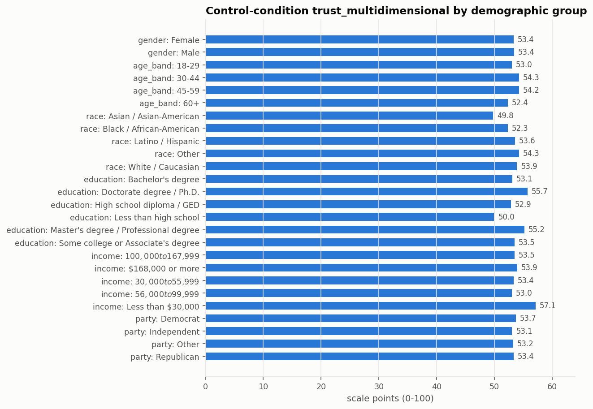
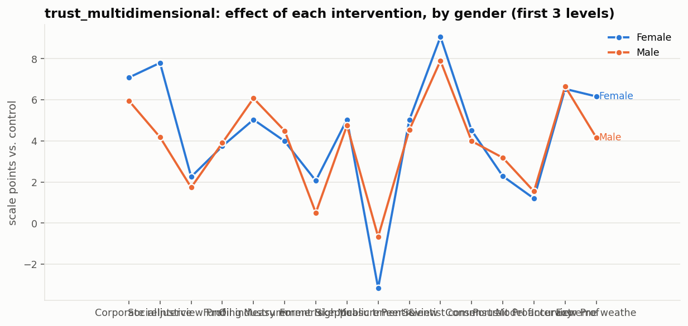
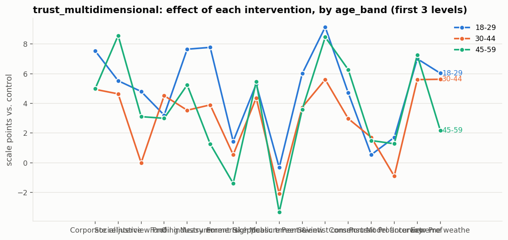
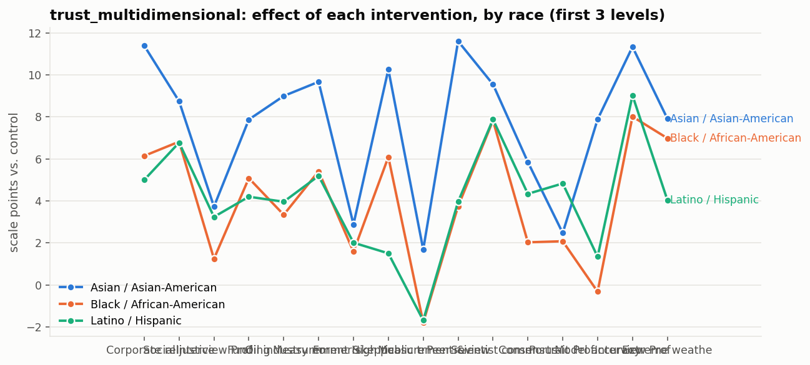
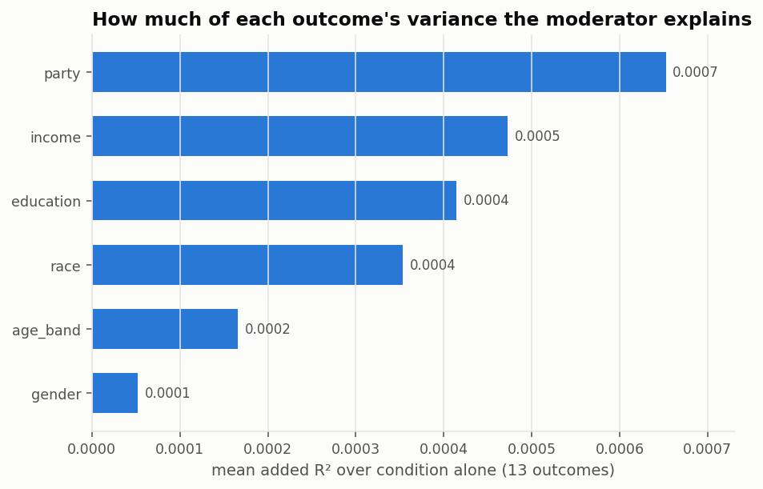

# Demographics: baselines, moderation, and predictability

[← main report](README.md) · sub-report 2 of 4

Three questions that fail differently, kept apart.

## 1. Do groups differ at baseline?

Cell means within the control condition. A synthetic sample can land the overall
average and still put every demographic group on top of it.

| moderator | level | n | mean | sd | conf_low | conf_high |
| --- | --- | --- | --- | --- | --- | --- |
| gender | Female | 1028 | 53.36 | 21.72 | 52.04 | 54.69 |
| gender | Male | 972 | 53.40 | 21.81 | 52.03 | 54.78 |
| age_band | 18-29 | 415 | 52.99 | 22.38 | 50.84 | 55.15 |
| age_band | 30-44 | 494 | 54.29 | 21.35 | 52.40 | 56.17 |
| age_band | 45-59 | 444 | 54.24 | 20.89 | 52.29 | 56.18 |
| age_band | 60+ | 647 | 52.36 | 22.24 | 50.64 | 54.07 |
| race | Asian / Asian-American | 130 | 49.75 | 21.63 | 46.00 | 53.51 |
| race | Black / African-American | 256 | 52.33 | 21.11 | 49.73 | 54.93 |
| race | Latino / Hispanic | 378 | 53.55 | 20.77 | 51.45 | 55.65 |
| race | Other | 53 | 54.28 | 21.32 | 48.41 | 60.16 |
| race | White / Caucasian | 1183 | 53.92 | 22.22 | 52.65 | 55.18 |
| education | Bachelor's degree | 627 | 53.06 | 21.43 | 51.38 | 54.74 |
| education | Doctorate degree / Ph.D. | 55 | 55.70 | 24.33 | 49.12 | 62.28 |
| education | High school diploma / GED | 447 | 52.85 | 22.07 | 50.80 | 54.90 |
| education | Less than high school | 65 | 49.96 | 20.49 | 44.88 | 55.04 |
| education | Master's degree / Professional degree | 269 | 55.20 | 21.05 | 52.67 | 57.72 |
| education | Some college or Associate's degree | 537 | 53.47 | 22.10 | 51.60 | 55.34 |
| income | $100,000 to $167,999 | 623 | 53.51 | 21.17 | 51.85 | 55.18 |
| income | $168,000 or more | 256 | 53.95 | 22.98 | 51.12 | 56.78 |
| income | $30,000 to $55,999 | 257 | 53.36 | 21.21 | 50.75 | 55.96 |
| income | $56,000 to $99,999 | 846 | 53.04 | 22.04 | 51.56 | 54.53 |
| income | Less than $30,000 | 18 | 57.12 | 20.33 | 47.02 | 67.23 |
| party | Democrat | 815 | 53.74 | 20.62 | 52.32 | 55.15 |
| party | Independent | 822 | 53.06 | 22.53 | 51.51 | 54.60 |
| party | Other | 90 | 53.24 | 24.80 | 48.05 | 58.44 |
| party | Republican | 273 | 53.35 | 21.76 | 50.76 | 55.94 |

## 2. Does the intervention work differently for different people?

Saturated `outcome ~ condition * moderator`, with a joint Wald test on the whole
interaction block. With 78 tests here, individual small p-values are
expected; the pattern matters more than any single row.

Strongest 15 interactions:

| moderator | outcome | n | interaction_terms | chi2 | df | p | r2 |
| --- | --- | --- | --- | --- | --- | --- | --- |
| income | donation_ams | 18000 | 64 | 119.6374 | 64 | 0.0000 | 0.0047 |
| income | distrust_post | 18000 | 64 | 97.9272 | 64 | 0.0041 | 0.0110 |
| income | behavior_mean | 18000 | 64 | 95.5390 | 64 | 0.0065 | 0.0108 |
| race | distrust_post | 18000 | 64 | 93.9492 | 64 | 0.0087 | 0.0110 |
| age_band | policy_general | 18000 | 48 | 69.0920 | 48 | 0.0247 | 0.0147 |
| race | inst_trust_mean | 18000 | 64 | 86.9056 | 64 | 0.0300 | 0.0107 |
| income | belief_post | 18000 | 64 | 85.9599 | 64 | 0.0350 | 0.0071 |
| income | policy_general | 18000 | 64 | 85.9192 | 64 | 0.0352 | 0.0141 |
| education | funding_perceptions | 18000 | 80 | 104.0608 | 80 | 0.0367 | 0.0075 |
| race | trust_post | 18000 | 64 | 85.1296 | 64 | 0.0399 | 0.0118 |
| income | trust_post | 18000 | 64 | 84.4215 | 64 | 0.0446 | 0.0109 |
| gender | behavior_mean | 18000 | 16 | 26.6089 | 16 | 0.0460 | 0.0076 |
| age_band | trust_post | 18000 | 48 | 64.4250 | 48 | 0.0568 | 0.0103 |
| education | behavior_mean | 18000 | 80 | 97.9616 | 80 | 0.0842 | 0.0116 |
| education | concern_mean | 18000 | 80 | 97.8248 | 80 | 0.0856 | 0.0154 |

## 3. How much is demographics alone? (stereotyping diagnostic)

`r2_moderator` is what the moderator adds once condition is already in the model.
A model answering from a stereotype produces a sample where knowing someone's
party tells you their answer almost exactly. Real survey data is much noisier
than that, so a large value here is a warning, not a success.

| moderator | outcome | n | r2_full | r2_condition_only | r2_moderator |
| --- | --- | --- | --- | --- | --- |
| party | belief_post | 18000 | 0.0043 | 0.0023 | 0.0020 |
| party | policy_general | 18000 | 0.0129 | 0.0109 | 0.0020 |
| party | policy_specific_mean | 18000 | 0.0187 | 0.0174 | 0.0013 |
| education | trust_post | 18000 | 0.0079 | 0.0067 | 0.0012 |
| income | funding_perceptions | 18000 | 0.0030 | 0.0019 | 0.0011 |
| race | belief_post | 18000 | 0.0034 | 0.0023 | 0.0011 |
| party | concern_mean | 18000 | 0.0104 | 0.0095 | 0.0010 |
| income | behavior_mean | 18000 | 0.0068 | 0.0060 | 0.0008 |
| race | concern_mean | 18000 | 0.0102 | 0.0095 | 0.0008 |
| education | concern_mean | 18000 | 0.0102 | 0.0095 | 0.0007 |
| age_band | funding_perceptions | 18000 | 0.0026 | 0.0019 | 0.0007 |
| race | inst_trust_mean | 18000 | 0.0064 | 0.0057 | 0.0007 |
| income | concern_mean | 18000 | 0.0102 | 0.0095 | 0.0007 |
| education | policy_role_mean | 18000 | 0.0169 | 0.0162 | 0.0007 |
| party | behavior_mean | 18000 | 0.0067 | 0.0060 | 0.0006 |
| income | policy_role_mean | 18000 | 0.0168 | 0.0162 | 0.0006 |
| income | belief_post | 18000 | 0.0029 | 0.0023 | 0.0005 |
| education | belief_post | 18000 | 0.0029 | 0.0023 | 0.0005 |
| party | inst_trust_mean | 18000 | 0.0063 | 0.0057 | 0.0005 |
| income | trust_multidimensional | 18000 | 0.0153 | 0.0148 | 0.0005 |
| race | trust_multidimensional | 18000 | 0.0153 | 0.0148 | 0.0005 |
| race | trust_post | 18000 | 0.0072 | 0.0067 | 0.0004 |
| income | inst_trust_mean | 18000 | 0.0062 | 0.0057 | 0.0004 |
| education | trust_multidimensional | 18000 | 0.0152 | 0.0148 | 0.0004 |
| income | policy_general | 18000 | 0.0112 | 0.0109 | 0.0004 |

## Demographic parity gaps

Largest gap between any two cells of a moderator, per outcome — the worst-case
group difference the sample implies.

| moderator | outcome | gap | worst_level | best_level |
| --- | --- | --- | --- | --- |
| income | funding_perceptions | 7.18 | $168,000 or more | Less than $30,000 |
| income | policy_role_mean | 6.05 | Less than $30,000 | $168,000 or more |
| income | belief_post | 5.17 | Less than $30,000 | $168,000 or more |
| income | trust_multidimensional | 4.60 | Less than $30,000 | $168,000 or more |
| education | trust_post | 3.89 | High school diploma / GED | Doctorate degree / Ph.D. |
| race | belief_post | 3.87 | Other | Latino / Hispanic |
| income | inst_trust_mean | 3.85 | Less than $30,000 | $168,000 or more |
| education | policy_role_mean | 3.42 | Less than high school | Doctorate degree / Ph.D. |
| party | policy_general | 3.31 | Other | Democrat |
| income | concern_mean | 3.27 | Less than $30,000 | $168,000 or more |
| income | trust_post | 3.19 | Less than $30,000 | $168,000 or more |
| income | policy_general | 2.97 | Less than $30,000 | $168,000 or more |
| education | concern_mean | 2.85 | High school diploma / GED | Doctorate degree / Ph.D. |
| education | trust_multidimensional | 2.76 | Less than high school | Doctorate degree / Ph.D. |
| education | policy_general | 2.72 | Less than high school | Doctorate degree / Ph.D. |
| party | policy_specific_mean | 2.69 | Other | Democrat |
| education | policy_specific_mean | 2.63 | Less than high school | Doctorate degree / Ph.D. |
| education | belief_post | 2.60 | Less than high school | Bachelor's degree |
| party | belief_post | 2.21 | Independent | Democrat |
| race | concern_mean | 2.10 | Other | Latino / Hispanic |
| education | distrust_post | 2.10 | Doctorate degree / Ph.D. | Less than high school |
| income | behavior_mean | 2.05 | $30,000 to $55,999 | $168,000 or more |
| race | inst_trust_mean | 1.82 | Black / African-American | Asian / Asian-American |
| race | trust_post | 1.82 | Black / African-American | White / Caucasian |
| age_band | funding_perceptions | 1.82 | 30-44 | 60+ |

## Marginals of the generated demographics

Gender, age and race were **pre-filled** from the preregistered quotas, so their
marginals are correct by construction and are not evidence about the model.
Education, income and party were **generated** by the model: their marginals are
a direct read on what population it produces when it is not told what to be.

| variable | level | share |
| --- | --- | --- |
| gender | Female | 0.5096 |
| gender | Male | 0.4904 |
| age_band | 60+ | 0.3089 |
| age_band | 30-44 | 0.2603 |
| age_band | 45-59 | 0.2291 |
| age_band | 18-29 | 0.2016 |
| race | White / Caucasian | 0.6018 |
| race | Latino / Hispanic | 0.1813 |
| race | Black / African-American | 0.1229 |
| race | Asian / Asian-American | 0.0667 |
| race | Other | 0.0273 |
| education | Bachelor's degree | 0.3264 |
| education | Some college or Associate's degree | 0.2412 |
| education | High school diploma / GED | 0.2227 |
| education | Master's degree / Professional degree | 0.1429 |
| education | Less than high school | 0.0348 |
| education | Doctorate degree / Ph.D. | 0.0321 |
| income | $56,000 to $99,999 | 0.4079 |
| income | $100,000 to $167,999 | 0.3185 |
| income | $168,000 or more | 0.1392 |
| income | $30,000 to $55,999 | 0.1266 |
| income | Less than $30,000 | 0.0077 |
| party | Democrat | 0.4312 |
| party | Independent | 0.3927 |
| party | Republican | 0.1306 |
| party | Other | 0.0456 |
