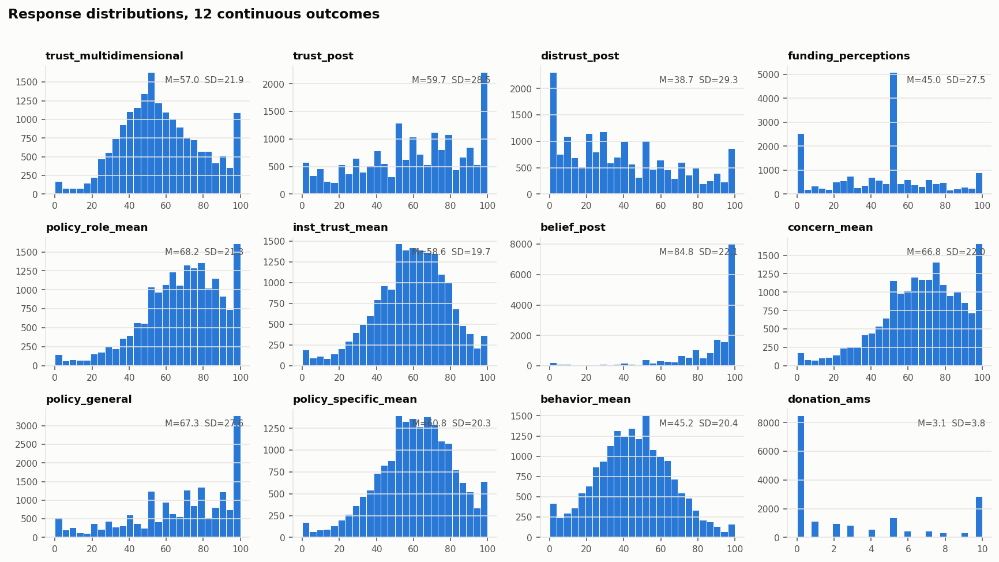
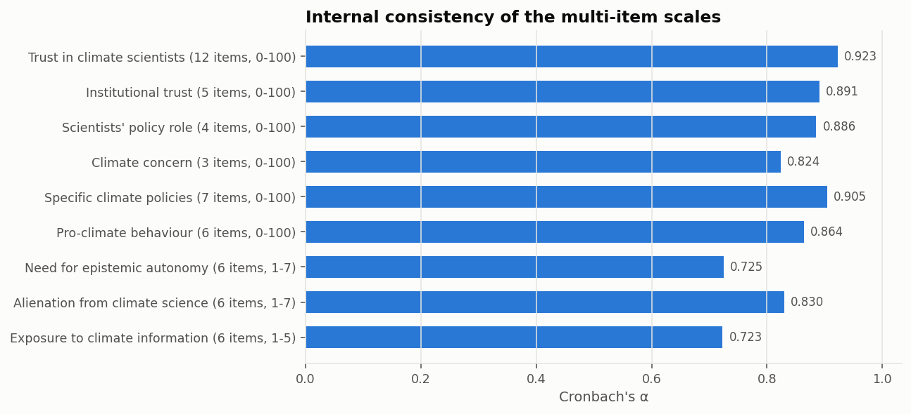
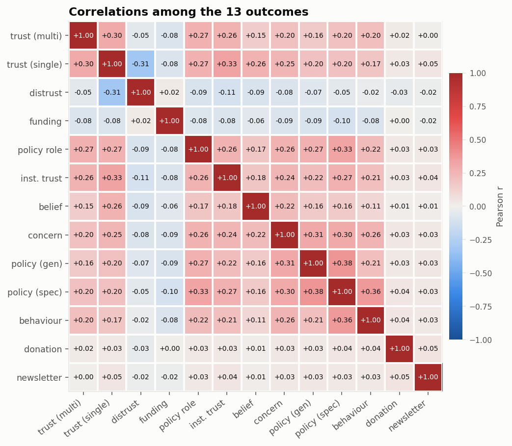

# Response distributions and scale properties

[← main report](README.md) · sub-report 3 of 4

The characteristic failure of a silicon sample is not a wrong mean — it is a
degenerate distribution. A sample can reproduce every average in a study and
still be useless for anything distributional. These are the checks for that.

## Outcome distributions

| variable | n | mean | sd | median | q25 | q75 | min | max | skew | kurtosis |
| --- | --- | --- | --- | --- | --- | --- | --- | --- | --- | --- |
| trust_multidimensional | 18000 | 57.04 | 21.90 | 54.58 | 42.00 | 71.67 | 0.00 | 100.00 | 0.14 | -0.38 |
| trust_post | 18000 | 59.66 | 28.53 | 62.00 | 40.00 | 83.00 | 0.00 | 100.00 | -0.34 | -0.86 |
| distrust_post | 18000 | 38.66 | 29.33 | 34.00 | 14.00 | 60.00 | 0.00 | 100.00 | 0.49 | -0.79 |
| funding_perceptions | 18000 | 45.02 | 27.51 | 50.00 | 25.00 | 60.00 | 0.00 | 100.00 | -0.00 | -0.54 |
| policy_role_mean | 18000 | 68.16 | 21.29 | 70.00 | 55.00 | 84.25 | 0.00 | 100.00 | -0.65 | 0.23 |
| inst_trust_mean | 18000 | 58.56 | 19.73 | 60.00 | 46.60 | 72.20 | 0.00 | 100.00 | -0.41 | 0.15 |
| belief_post | 18000 | 84.85 | 22.08 | 95.00 | 80.00 | 100.00 | 0.00 | 100.00 | -1.98 | 3.74 |
| concern_mean | 18000 | 66.83 | 22.02 | 68.67 | 53.33 | 83.33 | 0.00 | 100.00 | -0.59 | 0.07 |
| policy_general | 18000 | 67.33 | 27.63 | 72.00 | 50.00 | 90.00 | 0.00 | 100.00 | -0.71 | -0.36 |
| policy_specific_mean | 18000 | 60.76 | 20.34 | 61.71 | 48.29 | 75.00 | 0.00 | 100.00 | -0.38 | 0.04 |
| behavior_mean | 18000 | 45.20 | 20.38 | 45.00 | 31.50 | 58.83 | 0.00 | 100.00 | 0.10 | -0.20 |
| donation_ams | 18000 | 3.09 | 3.81 | 1.00 | 0.00 | 5.00 | 0.00 | 10.00 | 0.85 | -0.86 |
| newsletter_signup | 18000 | 0.31 | 0.46 | 0.00 | 0.00 | 1.00 | 0.00 | 1.00 | 0.83 | -1.31 |

## Degeneracy diagnostics

`modal_share` is the fraction of respondents giving the single most common
answer; the `share_at_*` columns pick out the scale endpoints and midpoint, which
is where a model that is guessing tends to pile up. `share_multiple_of_10` shows
how round the answers are — humans round too, so a value here is expected; a
value near 1.0 is not.

| variable | n | distinct | modal_value | modal_share | share_at_min | share_at_mid | share_at_max | share_multiple_of_10 | share_multiple_of_5 |
| --- | --- | --- | --- | --- | --- | --- | --- | --- | --- |
| trust_multidimensional | 18000 | 1736 | 100.000 | 0.050 | 0.005 | 0.022 | 0.050 | 0.104 | 0.144 |
| trust_post | 18000 | 101 | 100.000 | 0.102 | 0.019 | 0.054 | 0.102 | 0.420 | 0.572 |
| distrust_post | 18000 | 101 | 0.000 | 0.100 | 0.100 | 0.042 | 0.038 | 0.423 | 0.574 |
| funding_perceptions | 18000 | 101 | 50.000 | 0.266 | 0.129 | 0.266 | 0.040 | 0.596 | 0.703 |
| policy_role_mean | 18000 | 401 | 100.000 | 0.065 | 0.005 | 0.020 | 0.065 | 0.177 | 0.272 |
| inst_trust_mean | 18000 | 498 | 50.000 | 0.022 | 0.007 | 0.022 | 0.014 | 0.114 | 0.156 |
| belief_post | 18000 | 101 | 100.000 | 0.365 | 0.009 | 0.019 | 0.365 | 0.552 | 0.664 |
| concern_mean | 18000 | 301 | 100.000 | 0.055 | 0.007 | 0.022 | 0.055 | 0.176 | 0.231 |
| policy_general | 18000 | 101 | 100.000 | 0.155 | 0.023 | 0.055 | 0.155 | 0.483 | 0.611 |
| policy_specific_mean | 18000 | 686 | 100.000 | 0.024 | 0.007 | 0.018 | 0.024 | 0.096 | 0.123 |
| behavior_mean | 18000 | 593 | 50.000 | 0.022 | 0.013 | 0.022 | 0.006 | 0.095 | 0.151 |

## Item-level degeneracy

| variable | n | distinct | modal_value | modal_share | share_at_min | share_at_mid | share_at_max | share_multiple_of_10 | share_multiple_of_5 |
| --- | --- | --- | --- | --- | --- | --- | --- | --- | --- |
| trust_competent_1 | 18000 | 101 | 100.000 | 0.185 | 0.008 | 0.043 | 0.185 | 0.481 | 0.621 |
| trust_intelligent_1 | 18000 | 101 | 100.000 | 0.190 | 0.008 | 0.049 | 0.190 | 0.495 | 0.630 |
| trust_qualified_1 | 18000 | 101 | 100.000 | 0.176 | 0.016 | 0.055 | 0.176 | 0.490 | 0.625 |
| trust_honest_1 | 18000 | 101 | 100.000 | 0.119 | 0.038 | 0.070 | 0.119 | 0.478 | 0.619 |
| trust_ethical_1 | 18000 | 101 | 100.000 | 0.116 | 0.041 | 0.079 | 0.116 | 0.483 | 0.621 |
| trust_sincere_1 | 18000 | 101 | 100.000 | 0.113 | 0.042 | 0.076 | 0.113 | 0.482 | 0.617 |
| trust_concerned_1 | 18000 | 101 | 100.000 | 0.110 | 0.050 | 0.073 | 0.110 | 0.479 | 0.615 |
| trust_improve_1 | 18000 | 101 | 100.000 | 0.106 | 0.062 | 0.075 | 0.106 | 0.487 | 0.619 |
| trust_considerate_1 | 18000 | 101 | 100.000 | 0.100 | 0.062 | 0.077 | 0.100 | 0.482 | 0.616 |
| trust_feedback_1 | 18000 | 101 | 100.000 | 0.091 | 0.041 | 0.090 | 0.091 | 0.481 | 0.612 |
| trust_transparent_1 | 18000 | 101 | 100.000 | 0.078 | 0.074 | 0.072 | 0.078 | 0.480 | 0.614 |
| trust_attention_1 | 18000 | 101 | 50.000 | 0.083 | 0.058 | 0.083 | 0.081 | 0.476 | 0.609 |
| inst_trust_epa_1 | 18000 | 101 | 50.000 | 0.080 | 0.021 | 0.080 | 0.043 | 0.429 | 0.568 |
| inst_trust_nasa_1 | 18000 | 101 | 80.000 | 0.072 | 0.015 | 0.067 | 0.059 | 0.431 | 0.569 |
| inst_trust_noaa_1 | 18000 | 101 | 50.000 | 0.074 | 0.019 | 0.074 | 0.049 | 0.428 | 0.569 |
| inst_trust_uni_1 | 18000 | 101 | 50.000 | 0.074 | 0.011 | 0.074 | 0.046 | 0.423 | 0.565 |
| inst_trust_gov_1 | 18000 | 101 | 50.000 | 0.096 | 0.022 | 0.096 | 0.024 | 0.418 | 0.558 |
| policy_1_1 | 18000 | 101 | 100.000 | 0.166 | 0.008 | 0.042 | 0.166 | 0.468 | 0.595 |
| policy_2_1 | 18000 | 101 | 100.000 | 0.090 | 0.021 | 0.072 | 0.090 | 0.447 | 0.577 |
| policy_3_1 | 18000 | 101 | 100.000 | 0.148 | 0.007 | 0.044 | 0.148 | 0.458 | 0.582 |
| policy_4_1 | 18000 | 101 | 100.000 | 0.096 | 0.014 | 0.067 | 0.096 | 0.445 | 0.577 |
| concern_1_1 | 18000 | 101 | 100.000 | 0.131 | 0.010 | 0.053 | 0.131 | 0.464 | 0.598 |
| concern_2_1 | 18000 | 101 | 100.000 | 0.142 | 0.012 | 0.044 | 0.142 | 0.468 | 0.601 |
| concern_3_1 | 18000 | 101 | 100.000 | 0.089 | 0.017 | 0.077 | 0.089 | 0.449 | 0.590 |
| policy_specific_1_1 | 18000 | 101 | 50.000 | 0.071 | 0.031 | 0.071 | 0.069 | 0.442 | 0.582 |
| policy_specific_2_1 | 18000 | 101 | 50.000 | 0.085 | 0.021 | 0.085 | 0.064 | 0.452 | 0.586 |
| policy_specific_3_1 | 18000 | 101 | 100.000 | 0.103 | 0.014 | 0.058 | 0.103 | 0.459 | 0.592 |
| policy_specific_4_1 | 18000 | 101 | 100.000 | 0.080 | 0.021 | 0.077 | 0.080 | 0.453 | 0.584 |
| policy_specific_5_1 | 18000 | 101 | 50.000 | 0.084 | 0.040 | 0.084 | 0.052 | 0.454 | 0.583 |
| policy_specific_6_1 | 18000 | 101 | 100.000 | 0.076 | 0.016 | 0.073 | 0.076 | 0.450 | 0.582 |
| policy_specific_7_1 | 18000 | 101 | 100.000 | 0.086 | 0.019 | 0.068 | 0.086 | 0.454 | 0.585 |
| individual_meat_1 | 18000 | 101 | 50.000 | 0.079 | 0.047 | 0.079 | 0.037 | 0.451 | 0.591 |
| individual_transport_1 | 18000 | 101 | 50.000 | 0.088 | 0.040 | 0.088 | 0.031 | 0.450 | 0.588 |
| individual_solar_1 | 18000 | 101 | 0.000 | 0.096 | 0.096 | 0.066 | 0.022 | 0.467 | 0.599 |
| individual_fly_1 | 18000 | 101 | 50.000 | 0.080 | 0.067 | 0.080 | 0.025 | 0.459 | 0.593 |
| individual_talk_1 | 18000 | 101 | 50.000 | 0.080 | 0.024 | 0.080 | 0.046 | 0.453 | 0.586 |
| individual_donate_1 | 18000 | 101 | 50.000 | 0.088 | 0.060 | 0.088 | 0.023 | 0.460 | 0.589 |

## Scale reliability

| scale | items | alpha | mean_inter_item_r | min_inter_item_r |
| --- | --- | --- | --- | --- |
| Trust in climate scientists (12 items, 0-100) | 12 | 0.923 | 0.495 | 0.243 |
| Institutional trust (5 items, 0-100) | 5 | 0.891 | 0.617 | 0.500 |
| Scientists' policy role (4 items, 0-100) | 4 | 0.886 | 0.664 | 0.593 |
| Climate concern (3 items, 0-100) | 3 | 0.824 | 0.617 | 0.535 |
| Specific climate policies (7 items, 0-100) | 7 | 0.905 | 0.581 | 0.483 |
| Pro-climate behaviour (6 items, 0-100) | 6 | 0.864 | 0.514 | 0.376 |
| Need for epistemic autonomy (6 items, 1-7) | 6 | 0.725 | 0.318 | 0.009 |
| Alienation from climate science (6 items, 1-7) | 6 | 0.830 | 0.450 | 0.350 |
| Exposure to climate information (6 items, 1-5) | 6 | 0.723 | 0.304 | 0.186 |

## Straight-lining

Within-respondent SD across the items of one battery. `share_flat` is the
fraction who gave *identical* answers to every item in the battery — some of that
is real, a lot of it is a model copying its own previous line.

| battery | items | mean_within_sd | median_within_sd | share_flat |
| --- | --- | --- | --- | --- |
| Trust in climate scientists (12 items, 0-100) | 12 | 19.943 | 19.619 | 0.093 |
| Institutional trust (5 items, 0-100) | 5 | 13.924 | 12.740 | 0.059 |
| Scientists' policy role (4 items, 0-100) | 4 | 12.548 | 10.456 | 0.132 |
| Climate concern (3 items, 0-100) | 3 | 13.729 | 11.547 | 0.109 |
| Specific climate policies (7 items, 0-100) | 7 | 15.104 | 13.865 | 0.065 |
| Pro-climate behaviour (6 items, 0-100) | 6 | 17.602 | 16.753 | 0.046 |
| Need for epistemic autonomy (6 items, 1-7) | 6 | 1.459 | 1.506 | 0.034 |
| Alienation from climate science (6 items, 1-7) | 6 | 1.171 | 1.169 | 0.093 |
| Exposure to climate information (6 items, 1-5) | 6 | 1.086 | 1.095 | 0.049 |

## Position effects within a battery

Does the answer drift with an item's position? The transcript format could induce
this even where the content does not, since the model sees its own earlier
answers.

| battery | items | slope_per_item | r | p | first_item_mean | last_item_mean |
| --- | --- | --- | --- | --- | --- | --- |
| Trust in climate scientists (12 items, 0-100) | 12 | -2.6564 | -0.9061 | 0.0000 | 75.3551 | 46.3351 |
| Institutional trust (5 items, 0-100) | 5 | -1.7240 | -0.3511 | 0.5623 | 55.0549 | 46.8902 |
| Scientists' policy role (4 items, 0-100) | 4 | -1.4874 | -0.2487 | 0.7513 | 73.9766 | 63.7558 |
| Climate concern (3 items, 0-100) | 3 | -5.9635 | -0.7636 | 0.4469 | 69.8795 | 57.9524 |
| Specific climate policies (7 items, 0-100) | 7 | 0.5280 | 0.1787 | 0.7014 | 55.2727 | 64.2241 |
| Pro-climate behaviour (6 items, 0-100) | 6 | 0.2001 | 0.0472 | 0.9293 | 47.0738 | 41.6179 |
| Need for epistemic autonomy (6 items, 1-7) | 6 | -0.3083 | -0.5700 | 0.2376 | 5.0145 | 2.8126 |
| Alienation from climate science (6 items, 1-7) | 6 | -0.0277 | -0.2253 | 0.6678 | 3.4267 | 3.4035 |
| Exposure to climate information (6 items, 1-5) | 6 | -0.2490 | -0.7850 | 0.0644 | 3.2409 | 2.0800 |

## Outcome correlations

## Pre- vs post-treatment consistency

Two items are asked both before and after the manipulation. Their correlation is
an internal consistency check: a respondent who is a coherent person answers them
similarly, and the intervention explains the rest.

| pair | pearson_r |
| --- | --- |
| belief_pre vs belief_post | 0.596 |
| trust_pre vs trust_post | 0.667 |
