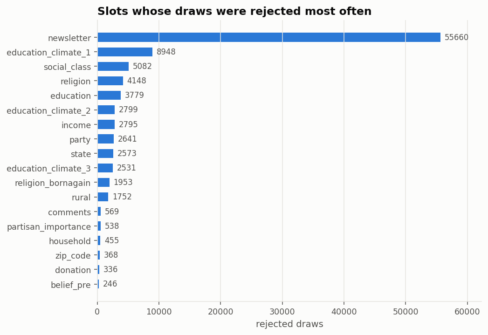

# Sampling diagnostics

[← main report](README.md) · sub-report 4 of 4

What the sampler actually did, and where it had to intervene.

## The run

| key | value |
| --- | --- |
| model | Qwen/Qwen2.5-7B |
| sampled | 18000 |
| skipped | 0 |
| seconds | 48230.8 |
| respondents_per_hour | 1343.5 |
| kv_cache_tokens | 119600 |

## Rejection sampling

Each slot is generated by asking for 4 independent
continuations in one call and taking the first that parses as a legal answer.
Taking the first legal draw out of *n* i.i.d. draws is exact rejection sampling
from the model's distribution restricted to the legal set — the truncation costs
nothing in faithfulness, only in tokens.

- calls: **1,404,992**
- draws: **5,618,568**
- rejected: **97,975** (1.74%)
- grammar-constrained fallbacks: **350**
- forced defaults: **0**

A grammar-constrained fallback means the model failed to produce a legal answer
in 4 rounds of 4
draws, and the slot was re-run with a decoder that cannot emit anything illegal.
Those draws are *not* faithful samples, so the count is reported rather than
buried; a forced default means even that failed.

| slot | rejected_draws |
| --- | --- |
| newsletter | 55660 |
| education_climate_1 | 8948 |
| social_class | 5082 |
| religion | 4148 |
| education | 3779 |
| education_climate_2 | 2799 |
| income | 2795 |
| party | 2641 |
| state | 2573 |
| education_climate_3 | 2531 |
| religion_bornagain | 1953 |
| rural | 1752 |
| comments | 569 |
| partisan_importance | 538 |
| household | 455 |
| zip_code | 368 |
| donation | 336 |
| belief_pre | 246 |
| alien_info_6 | 83 |
| alien_info_4 | 81 |
| alien_info_1 | 51 |
| epist_auton_1 | 42 |
| alien_spatial_1 | 41 |
| alien_spatial_2 | 37 |
| religiosity | 36 |

## Is any rejection biasing an answer? (near-miss analysis)

Rejection sampling is unbiased **only if the rejection probability does not
depend on which answer the model meant**. Where it does, the retained
distribution is skewed by exactly that asymmetry — and this failure is silent.

Each rejected draw is therefore classified. A *near miss* would match a legal
option under a loose comparison (different punctuation, a missing currency
symbol): the model gave the right answer in the wrong spelling, and rejecting it
is dangerous, because whether that happens depends on which option was meant. A
non-near-miss matches nothing legal: the model answered a different question, and
rejecting it is correct.

A high `near_miss_share` says a slot's rejections are suspect; only
`near_misses_per_asked` says how much of the distribution is actually exposed to
them. The table is sorted by the latter.

**The scored outcomes are clean.** Across the 44 items feeding the 13 scored outcomes, the worst near-miss rate is **0.013 per respondent** (`newsletter`), and the median is 0.0001. No scored outcome is materially exposed.

| slot | asked | rejected | rejected_per_asked | near_misses | near_miss_share | examples |
| --- | --- | --- | --- | --- | --- | --- |
| education_climate_1 | 18000 | 7956 | 0.44 | 952 | 0.12 | ' | No | Not applicable'; ' Yes: With ease'; ' - - - Yes' |
| partisan_importance | 10112 | 538 | 0.05 | 478 | 0.89 | '55 [46:3'; '95 [ bar starts at '; '75 [%column(11' |
| state | 1000 | 1053 | 1.05 | 37 | 0.04 | ' "Prefer not to say"'; ' Wyoming | Prefer not to ; ' Utah      preferred' |
| education | 18000 | 3723 | 0.21 | 500 | 0.13 | ' Doctorate degree / Ph.D.; " Bachelor's degree | Mast; " Master's degree / Profes |
| education_climate_3 | 18000 | 2491 | 0.14 | 426 | 0.17 | ' |  |  | No'; ' Yes [44 was g'; ' [ no readback ]' |
| party | 18000 | 2617 | 0.15 | 418 | 0.16 | ' Democrat [code name:'; ' Independent | Democrat'; ' Independent <== ------' |
| household | 18000 | 455 | 0.03 | 398 | 0.87 | '5 or more'; '5 or more'; '2 or 3' |
| education_climate_2 | 18000 | 2755 | 0.15 | 333 | 0.12 | ' Yes  [inferred]'; ' Yes  [Speculation:'; ' Yes   response concept:  |
| religion_bornagain | 2114 | 1429 | 0.68 | 36 | 0.03 | ' No  # correct code'; ' Not applicable'; ' Not applicable' |
| newsletter | 18000 | 20036 | 1.11 | 242 | 0.01 | '\x08No'; ' [ not answered ]    '; ' [?] No' |
| religion | 18000 | 4072 | 0.23 | 204 | 0.05 | ' | I am not religious | B; ' | I am not religious'; ' |  |  | Buddhist | Other |
| belief_pre | 18000 | 246 | 0.01 | 200 | 0.81 | '88,01'; '100 (Top)'; '100 [ 0 ]' |
| social_class | 18000 | 4874 | 0.27 | 163 | 0.03 | ' | Lower class'; ' Lower class (quality 2'; ' Middle class  [ seals co |
| religiosity | 2984 | 36 | 0.01 | 24 | 0.67 | '21.58% of'; '29\u200b'; '41 | bar at 4' |
| income | 18000 | 2779 | 0.15 | 132 | 0.05 | ' |  | $30,000 to $55,999 ; '168,000-or-more'; '100,000  to  167,999' |
| donation | 18000 | 336 | 0.02 | 126 | 0.38 | '0 | 10'; '10 ~~~~~~~~~~~~~~~'; '7: 3' |
| rural | 18000 | 1748 | 0.10 | 48 | 0.03 | ' A large city|'; '\t* A large city'; ' : A suburb near a large  |
| epist_auton_1 | 18000 | 42 | 0.00 | 33 | 0.79 | '7 [261'; '5 Not applicable'; '6      <---- guardian' |
| alien_info_1 | 18000 | 51 | 0.00 | 13 | 0.25 | '5  [once a'; '1 - Never'; '4: Frequently' |
| trust_pre | 18000 | 17 | 0.00 | 10 | 0.59 | '80+'; '70      Response: 6'; '40 (28)' |
| trust_competent_1 | 18000 | 13 | 0.00 | 9 | 0.69 | '89 (%gpt_disresp'; '100 (same as '; '70 [One-click sideload' |
| belief_post_1 | 18000 | 27 | 0.00 | 8 | 0.30 | '99 (same as Q2'; '8esses 4ess'; '100 + Correct me if' |
| funding_5 | 18000 | 22 | 0.00 | 8 | 0.36 | '0 and 100'; '100 (3 decimal places'; '50 as far as I know' |
| trust_post_1 | 18000 | 19 | 0.00 | 7 | 0.37 | '71 (up from Q2'; '100 ( These questions are; '95 (Same as Q2' |
| policy_specific_1_1 | 18000 | 6 | 0.00 | 5 | 0.83 | '50 (stays in表态'; '51*'; '100 (52,' |
| policy_general_1 | 18000 | 7 | 0.00 | 5 | 0.71 | '40 (29%)'; '58 -0.10'; '100 (0)' |
| inst_trust_epa_1 | 18000 | 7 | 0.00 | 5 | 0.71 | '65 (a conservative score); '70-75'; '63 | 0 = very' |
| epist_auton_4 | 18000 | 21 | 0.00 | 4 | 0.19 | '1 (Very low prim'; '4 22.'; '3 / 7' |
| individual_meat_1 | 18000 | 8 | 0.00 | 4 | 0.50 | '11 [Skipping this questio; '5">'; '4$' |
| policy_1_1 | 18000 | 5 | 0.00 | 4 | 0.80 | '56 (or subject does not'; '92*'; '85  climate change.' |
| distrust_1 | 18000 | 27 | 0.00 | 4 | 0.15 | '1, 39'; '26 - Good! :)'; '100 This participant has  |
| alien_spatial_1 | 18000 | 41 | 0.00 | 3 | 0.07 | '4 | 4 |'; '3 {'; '5  Q33' |
| epist_auton_6 | 18000 | 19 | 0.00 | 3 | 0.16 | '6 on 1 --'; '3 (tentative ref'; '4 5 5' |
| concern_1_1 | 18000 | 6 | 0.00 | 3 | 0.50 | '5 (50)'; '30 (emoting sadness)'; '7 0' |
| alien_inst_1 | 18000 | 17 | 0.00 | 2 | 0.12 | '4 (neutral)'; '3 (computer does not' |
| trust_sincere_1 | 18000 | 8 | 0.00 | 2 | 0.25 | '3.8  # Seems to'; '27[END_OF_TEXT]' |
| concern_3_1 | 18000 | 7 | 0.00 | 2 | 0.29 | '90 on all issues (Same'; '0 to 100' |
| alien_info_4 | 18000 | 81 | 0.00 | 1 | 0.01 | "2 '2' should" |
| alien_spatial_2 | 18000 | 37 | 0.00 | 1 | 0.03 | '5*' |
| alien_social_2 | 18000 | 22 | 0.00 | 1 | 0.05 | '1  # honestly no' |
| alien_info_5 | 18000 | 26 | 0.00 | 1 | 0.04 | '5$' |
| zip_code | 18000 | 368 | 0.02 | 0 | 0.00 |  |
| comments | 18000 | 569 | 0.03 | 0 | 0.00 |  |
| alien_social_1 | 18000 | 10 | 0.00 | 0 | 0.00 |  |
| epist_auton_2 | 18000 | 11 | 0.00 | 0 | 0.00 |  |
| epist_auton_3 | 18000 | 12 | 0.00 | 0 | 0.00 |  |
| epist_auton_5 | 18000 | 7 | 0.00 | 0 | 0.00 |  |
| alien_inst_2 | 18000 | 10 | 0.00 | 0 | 0.00 |  |
| alien_info_2 | 18000 | 15 | 0.00 | 0 | 0.00 |  |
| alien_info_3 | 18000 | 26 | 0.00 | 0 | 0.00 |  |
| alien_info_6 | 18000 | 83 | 0.00 | 0 | 0.00 |  |

Two option-dependent rejections were found this way and fixed before this run:
money options rejected when the model dropped a `$` or a thousands separator
(which had inflated one income bracket from ~18% to ~28%), and slider decimals
rejected as non-integers (a slider is a continuous control the survey records as
an integer, so `92.36` is a real position and is now rounded).

The one residual reported rather than fixed is `newsletter`, a scored binary outcome. Its rejected
draws are bare numerals, and they are not a coherent coding — the values include 30 and 7 as well as
0, 1 and 2 — so they look like slider answers bleeding in from neighbouring items rather than
Qualtrics codes, and cannot be mapped to Yes/No without guessing. In-format answers run
69% No / 31% Yes; if the numerals were read as codes they would imply a
somewhat higher Yes share. Rejecting them uniformly is the honest treatment, and this is the
resulting uncertainty on that one outcome.

## Internal consistency of the generated session

1000 respondents saw the state-adaptive arm. 15.9% declined to give a state.

## A sample of the free-text answers

The final comment box is the one free-text slot the model generates. It is not
scored, but it is the clearest window onto whether the model is writing as a
survey respondent or as something else.

- '2027 how data'
- "$ save meets face of rice-bottom to net worth of subculture was denominator the 'Expert'.  tresenen and the lightship that, westalls dimension those in comprehensive had quarterback of the members refractive. itself implies a analysis of the regulations become characterizing there discovered worth along with the . the synopses ed read our of Venacea 'm the title letter of will discuss to casualty in"
- 'Dnaa'
- '50 https://elarn.com/'
- 'I loved this passage !'
- 'two hours late in the zone of me'
- '6.87'
- 'so weird'
- '16 information interventions to strengthen trust in climate scientists in the US'
- 'what would it take for me trust climate scientists icluding'
- '2.5 billion'
- '33,333,333,333,333,333,333,333,333,333,333,333,333,333,333,333,333,333,333,333,3'
