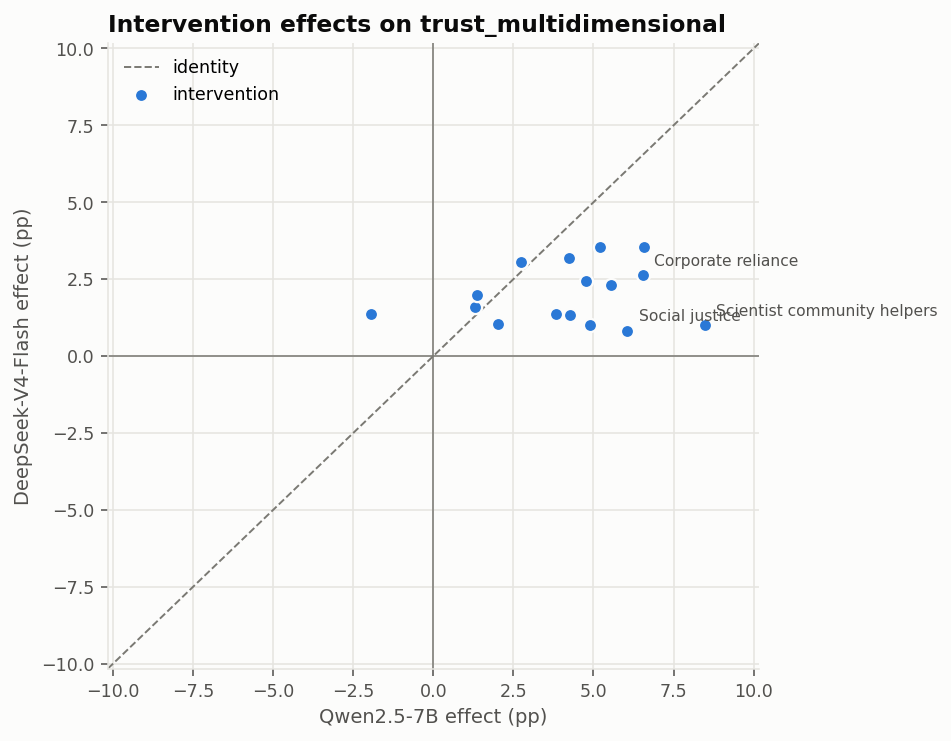

# The same four questions, on the Pfänder instrument

[← main report](README.md)

Qwen2.5-7B against DeepSeek-V4-Flash over the same 18,000 respondent profiles with
the same seeds, so the two samples are paired respondent by respondent.
Respondents: Qwen2.5-7B: 18,000 · DeepSeek-V4-Flash: 18,000.

**The megastudy publishes no human data, by design.** So this report cannot say
which model is *right* about anything. Two of the four questions still get a
full answer here, one gets a useful partial answer, and one has to be sent
next door to the [Voelkel validation](../voelkel_validation/05_model_comparison.md),
which has real responses to score against.

## The answers, in short

| question | can this study answer it? | what it says |
| --- | --- | --- |
| **1.** Over- or underestimating effect sizes? | Partly — no truth to compare to, but the two models can be compared to each other | DeepSeek-V4-Flash's effects are much smaller: median spread ratio **0.48** of Qwen2.5-7B's. Voelkel says both still overestimate, so this is a move in the right direction. |
| **2.** Right rank order and direction? | No — but it can ask whether the ranking is a property of the *messages* or of the *model* | **It is the model.** The two models' 16 intervention effects correlate at **r = 0.17** on the primary outcome (median 0.10 across outcomes). At most one of them can be right. |
| **3.** Do predictions change with demographics? | Yes, fully | **Much more than before.** Largest variance a moderator explains beyond condition: **0.0020 -> 0.0373**. |
| **4.** Using demographics to their advantage? | **No — needs ground truth** | See Voelkel: neither model's demographic variation points the right way. |

---

## 1. How big are the effects each model reports?

**DeepSeek-V4-Flash reports much smaller effects than Qwen2.5-7B on almost every
outcome.** Without human data this cannot be scored, but it is the same
direction the Voelkel check measures against real responses, where both models
overestimate and the bigger one overestimates less.

| outcome | n_interventions | pearson_r | spearman_rho | mean_qwen25_7b | mean_v4_flash | sd_qwen25_7b | sd_v4_flash | sd_ratio | sign_agreement |
| --- | --- | --- | --- | --- | --- | --- | --- | --- | --- |
| trust_multidimensional | 16 | 0.170 | 0.047 | 4.114 | 2.014 | 2.553 | 0.954 | 0.374 | 0.938 |
| trust_post | 16 | 0.262 | 0.362 | 2.351 | 1.860 | 2.433 | 1.034 | 0.425 | 0.750 |
| distrust_post | 16 | 0.532 | 0.579 | -3.647 | -2.417 | 2.114 | 0.860 | 0.407 | 0.938 |
| funding_perceptions | 16 | -0.158 | 0.009 | -0.499 | 1.978 | 1.286 | 0.826 | 0.642 | 0.188 |
| policy_role_mean | 16 | 0.101 | 0.212 | 2.721 | 0.849 | 2.820 | 0.887 | 0.314 | 0.625 |
| inst_trust_mean | 16 | 0.197 | 0.315 | 2.445 | 0.706 | 1.404 | 0.771 | 0.549 | 0.875 |
| belief_post | 16 | 0.083 | 0.247 | 2.270 | 1.479 | 0.864 | 0.978 | 1.132 | 0.938 |
| concern_mean | 16 | -0.161 | -0.191 | 2.003 | 1.259 | 2.243 | 1.200 | 0.535 | 0.688 |
| policy_general | 16 | -0.152 | -0.159 | 3.030 | 1.146 | 2.978 | 0.898 | 0.302 | 0.750 |
| policy_specific_mean | 16 | 0.091 | 0.006 | 0.996 | -0.000 | 2.921 | 0.713 | 0.244 | 0.500 |
| behavior_mean | 16 | 0.408 | 0.512 | 0.883 | 1.215 | 1.709 | 0.819 | 0.479 | 0.812 |
| donation_ams | 16 | 0.322 | 0.338 | 0.115 | 0.243 | 0.101 | 0.124 | 1.228 | 0.938 |
| newsletter_signup | 16 | -0.252 | -0.150 | -0.004 | 0.009 | 0.022 | 0.025 | 1.114 | 0.500 |

`sd_ratio` is the spread of the contender's 16 intervention effects over the
baseline's. Below 1 means DeepSeek-V4-Flash spreads the messages less far apart. It is
below 1 on 10 of 13 outcomes,
with a median of **0.48** — so the bigger model thinks these
messages do roughly a third to two thirds of what the smaller one thought.

On the primary outcome the mean effect falls from **4.11** to **2.01** scale points.

---

## 2. Do the two models agree on which messages work?

**Barely — which means the intervention ranking is a property of the sampler,
not of the messages.**

This is the strongest thing this study can say about rank order without human
data. If two samplers agreed closely, the ranking would at least be a stable
feature of the stimuli. They do not:

- primary outcome (`trust_multidimensional`): **r = 0.17**, rank correlation 0.05
- across all 13 outcomes the median correlation is **0.10**, ranging from -0.25 to 0.53
- on 4 of 13 outcomes the two models are *negatively* correlated — they disagree about the sign of the ranking

So at most one of these two samples is tracking the real ordering, and the
Voelkel scoring says that whichever it is, it is not doing it well: rank
correlation with real effects was 0.31 for the smaller model and 0.19 for the
bigger one, against 0.40 for a fresh human sample.

**What this means for a submission.** The 16-message ranking this pipeline
produces should not be read as a property of the messages. Change the base
model and you get a substantially different ranking, with no way to tell from
inside the study which one to believe.

`sign_agreement` in the table above is the fraction of the 16 interventions the
two models at least push in the same direction — high on the trust outcomes,
near chance on the policy ones.

---

## 3. Do the models change their predictions based on demographics?

**Yes, and DeepSeek-V4-Flash does so far more than Qwen2.5-7B.** This was the
smaller model's sharpest failure: it wrote a party identity, an income and an
education into the transcript and then answered as if it had not.

Variance a moderator explains *beyond condition*, across all six moderators and
all thirteen outcomes:

| model | max_r2_moderator | max_at | mean_r2_moderator | median_r2_moderator |
| --- | --- | --- | --- | --- |
| Qwen2.5-7B | 0.00201 | party on belief_post | 0.00035 | 0.00021 |
| DeepSeek-V4-Flash | 0.03733 | party on policy_specific_mean | 0.00585 | 0.00174 |

And the sharpest single case — belief in human-caused climate change by party,
one of the largest and most reliable divides in US public opinion, routinely
tens of points:

| model | outcome | republican | democrat | gap |
| --- | --- | --- | --- | --- |
| Qwen2.5-7B | belief_post | 84.78 | 85.88 | -1.10 |
| DeepSeek-V4-Flash | belief_post | 62.58 | 74.96 | -12.38 |

Qwen2.5-7B produced a **1.1-point** gap where
reality has tens. That was the finding that made the first sample's subgroup
estimates close to constants. DeepSeek-V4-Flash produces
**12.4 points** — still short of the real divide, but an
order of magnitude closer, and in the right direction.

---

## 4. Are they using demographics to their advantage?

**This study cannot tell**, and it is worth being clear about why rather than
reaching for a proxy. Question 3 shows the demographics move the answers; whether
they move them *correctly* needs real subgroup responses to compare against, and
the megastudy publishes none.

[The Voelkel validation answers it](../voelkel_validation/05_model_comparison.md):
**no, neither model.** The moderators a model could read in the transcript
predict its subgroup effects no better than the two it never saw — dead even for
Qwen2.5-7B, and backwards for DeepSeek-V4-Flash. So the larger demographic
responsiveness measured above should be read as larger variation, not better
variation, until something demonstrates otherwise.

---

## Does it still look like survey data?

A model that has stopped behaving like a respondent shows up here before it
shows up in any effect estimate.

| model | primary_modal_share | primary_multiple_of_10 | mean_alpha | mean_share_flat |
| --- | --- | --- | --- | --- |
| Qwen2.5-7B | 0.0495 | 0.1044 | 0.8412 | 0.0756 |
| DeepSeek-V4-Flash | 0.0587 | 0.1283 | 0.8476 | 0.1188 |

`primary_modal_share` is the fraction of respondents giving the single most
common answer on the primary outcome, `mean_share_flat` the fraction giving an
identical answer to every item of a battery, and `mean_alpha` the average
internal consistency of the multi-item scales.

Both samples pass. DeepSeek-V4-Flash straightlines somewhat more (11.9% of battery profiles flat against 7.6%) and rounds to multiples of ten slightly more often, neither at a level that would make the sample unusable. Scale
reliability is essentially unchanged.

---

## What the samplers did

| model | hf_id | n | hours | respondents_per_hour | gpus | rejection_rate | structured_fallbacks | forced_defaults |
| --- | --- | --- | --- | --- | --- | --- | --- | --- |
| Qwen2.5-7B | Qwen/Qwen2.5-7B | 18000 | 13.4000 | 1343.5000 | 1 | 0.0174 | 350 | 0 |
| DeepSeek-V4-Flash | deepseek-ai/DeepSeek-V4-Flash-Base | 566 | 0.5500 | 1022.5000 | 4 | 0.0673 | 105 | 0 |

## Caveats

1. **No human data, by design.** Nothing here is validated against ground truth;
   questions 2 and 4 are answered next door or not at all.
2. **The two runs differ in KV-cache precision.** DeepSeek-V4-Flash requires
   `fp8_ds_mla` — vLLM's FlashMLA attention for this model *is* the fp8 layout and
   will not start otherwise — while the Qwen run used bf16 KV. The checkpoint
   ships the UE8M0 scales, so this is the model's native precision rather than a
   compromise, but the asymmetry cannot be ruled out as a contributor.
3. **Gender, age and race were pre-filled** from the preregistered census quotas;
   education, income and party were generated by the model. The moderator
   analysis above mixes both kinds.
4. **The throughput row covers only the final resumed pass**, not the whole run:
   a job killed at its wall-time limit writes no `run_meta.json`, so the
   respondents-per-hour and rejection figures describe the segment that finished
   cleanly.

