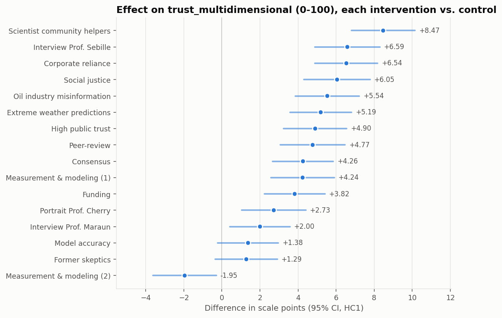
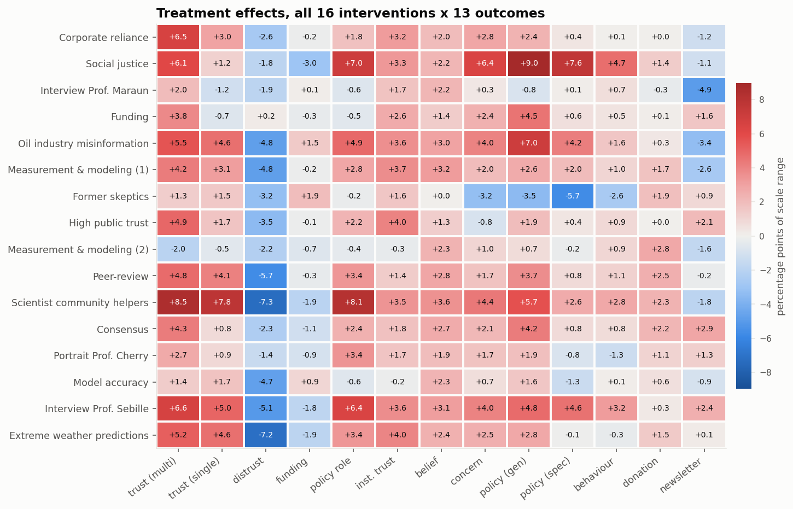

# Silicon sample of the Pfänder megastudy — main results

Qwen2.5-7B (base), sampled respondent by respondent through a text transcript of
the full instrument. **N = 18,000** synthetic respondents across
17 conditions (2,000 control, 1,000 per intervention).

The same 18,000 profiles were later resampled with **DeepSeek-V4-Flash-Base
(~290 B)** — see [sub-report 5](05_model_comparison.md). Everything below describes
the Qwen sample.

Sub-reports: [1 · intervention effects](01_effects.md) ·
[2 · demographics](02_demographics.md) ·
[3 · distributions](03_distributions.md) ·
[4 · sampling diagnostics](04_diagnostics.md) ·
[5 · Qwen2.5-7B against DeepSeek-V4-Flash](05_model_comparison.md)

## What a 40x bigger base model changed

**[Full comparison →](05_model_comparison.md)**, structured around four questions.
The short version, with the caveat that this study publishes no human data so only
two of the four can be answered here:

| | Qwen2.5-7B | DeepSeek-V4-Flash |
| --- | --- | --- |
| partisan gap, belief in human-caused climate change | -1.1 pp | **-12.4 pp** |
| largest moderator R² beyond condition | 0.0020 | **0.0373** |
| spread of the 16 intervention effects | — | **0.48x** Qwen's (median) |
| agreement with the other model on which messages work | r = 0.17 on the primary outcome, median 0.10 across all 13 | |

Two findings matter for a submission built on this pipeline.

**The demographic flatness described below is substantially fixed.** The partisan
gap on climate belief was this sample's headline weakness at 1.1 points where real
US survey data has tens; the bigger model produces 12.4. Still short of reality,
an order of magnitude closer. But the
[Voelkel validation](../voelkel_validation/05_model_comparison.md) shows that the
extra demographic variation does not point the *right* way — so read it as more
variation, not better variation.

**The intervention ranking is a property of the sampler, not of the messages.**
The two models' 16 effects correlate at r = 0.17 on the primary outcome and
negatively on four of the thirteen outcomes. At most one of these rankings tracks
reality, and against real responses neither does it well. Whichever model is
submitted, the message ordering should not be presented as a finding about the
messages.

## Headline

On the primary outcome — multidimensional trust in climate scientists, 0-100 —
the control mean is **53.4**. Across the 16 interventions the
effects run from **-1.95** (Measurement & modeling (2))
to **+8.47** (Scientist community helpers) scale points.
15 of 16 point in the positive direction.

Across all 13 outcomes, **57 of 208** effects
survive Holm correction at α = 0.05.

## How to read this

Three things decide whether this sample is worth anything, and they are separable:

1. **Does it move in the right direction?** — [sub-report 1](01_effects.md).
2. **Does it put the right people in the right places?** — [sub-report 2](02_demographics.md).
   The strongest demographic signal is **party** on
   `belief_post` (adds R² = 0.002 over
   condition alone).
3. **Does it look like survey data at all?** — [sub-report 3](03_distributions.md).
   On the primary outcome the modal answer is taken by
   5.0% of respondents, and
   10.4% of answers are multiples of 10.

## The headline weakness: these respondents have no demographics

This sample's respondents are demographically **flat**. The model writes a party
identity, an income and an education into the transcript, then answers the rest of
the questionnaire as if it had not.

On belief in human-caused climate change, the synthetic Republicans and Democrats
differ by **1.1 points on a 0-100 scale**
(84.8 vs
85.9). In US survey data this is one of
the largest and most reliable partisan gaps in the whole of public opinion —
routinely tens of points. Across all six moderators and all 13 outcomes, the
largest variance any moderator explains beyond condition is
**R² = 0.002** (party on
`belief_post`).

What makes this sharp rather than merely disappointing is that the *within*-person
structure is good. The multi-item scales hold together like real ones — Cronbach's
α of 0.92 on the 12-item trust battery, 0.90 on the
seven policy items — and only 9% of respondents give a flat profile
across all twelve trust items. The model writes a coherent individual; it just
writes nearly the *same* individual every time, whatever demographics it has
placed at the top of the page.

This is the *opposite* of the failure the benchmark's stereotyping diagnostic is
built to catch. A model answering from a stereotype produces subgroup differences
that are too large and too clean; this one produces almost none. For the
benchmark that is the more damaging error of the two, because every subgroup and
demographic-baseline estimate the submission makes is close to a constant, while
the average treatment effects — which do not depend on between-person variation —
remain usable. Detail in [sub-report 2](02_demographics.md).

## Between-message variation

A prediction that gets the average effect right but cannot tell the messages
apart is doing only half the job. Removing sampling noise from the observed
spread leaves **2.41 pp** of real
between-message variation on the primary outcome
(observed SD 2.55 pp).

| outcome | mean_effect_pp | min_effect_pp | max_effect_pp | sd_effect_pp | true_sd_effect_pp | n_positive | n_significant_holm |
| --- | --- | --- | --- | --- | --- | --- | --- |
| trust_multidimensional | 4.114 | -1.951 | 8.471 | 2.553 | 2.410 | 15 | 11 |
| trust_post | 2.351 | -1.187 | 7.824 | 2.433 | 2.167 | 13 | 5 |
| distrust_post | -3.647 | -7.283 | 0.205 | 2.114 | 1.778 | 1 | 7 |
| funding_perceptions | -0.499 | -2.968 | 1.932 | 1.286 | 0.719 | 4 | 0 |
| policy_role_mean | 2.721 | -0.632 | 8.125 | 2.820 | 2.693 | 11 | 7 |
| inst_trust_mean | 2.445 | -0.326 | 4.030 | 1.404 | 1.174 | 14 | 8 |
| belief_post | 2.270 | 0.016 | 3.555 | 0.864 | 0.000 | 16 | 2 |
| concern_mean | 2.003 | -3.223 | 6.411 | 2.243 | 2.076 | 14 | 5 |
| policy_general | 3.030 | -3.464 | 8.957 | 2.978 | 2.777 | 14 | 6 |
| policy_specific_mean | 0.996 | -5.691 | 7.582 | 2.921 | 2.812 | 11 | 4 |
| behavior_mean | 0.883 | -2.556 | 4.718 | 1.709 | 1.513 | 13 | 2 |
| donation_ams | 1.153 | -0.345 | 2.755 | 1.011 | 0.000 | 15 | 0 |
| newsletter_signup | -0.431 | -4.950 | 2.850 | 2.203 | 1.286 | 7 | 0 |

## Caveats

- The human data does not exist for anyone outside the study team, by design, so
  nothing here has been validated against ground truth. What can be checked —
  legality of draws, non-degeneracy, plausibility of the generated demographics —
  is in sub-reports 3 and 4.
- Gender, age and race were pre-filled from the preregistered census quotas;
  education, income and party were generated by the model.
- Every respondent answers every question: the real instrument lets participants
  skip most items, so the human data will carry missingness this sample does not.
- Attention checks and consent items were pre-filled as passed, matching a human
  sample that contains only respondents who passed them.
