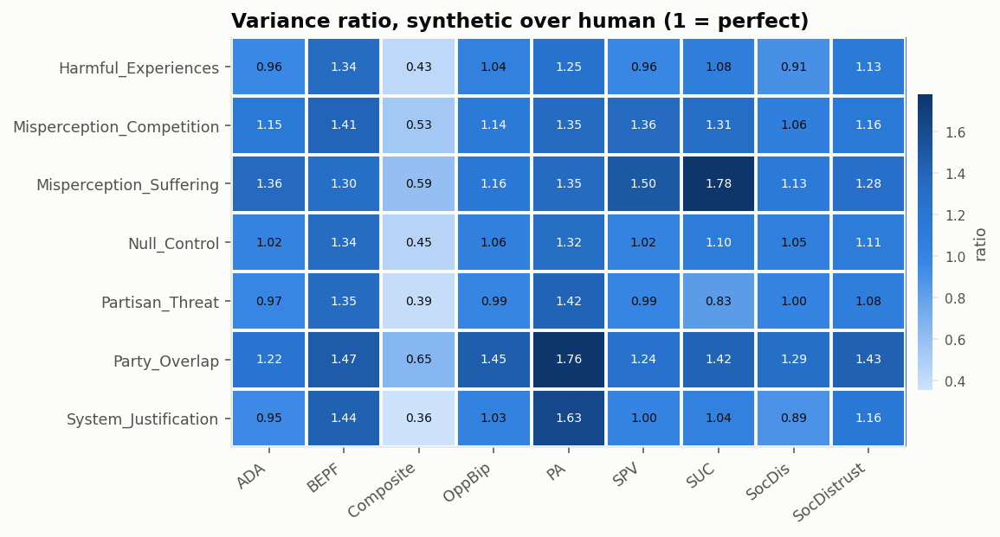
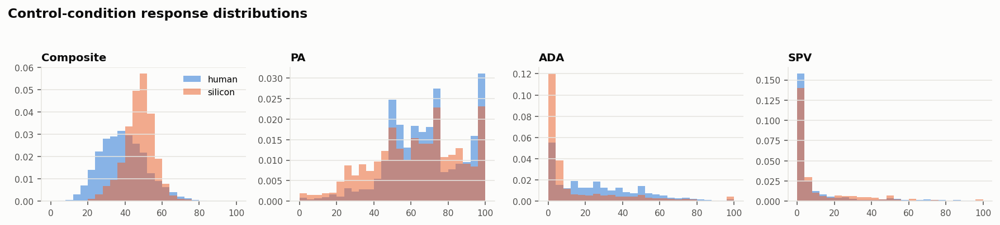

# Distributions

[← main report](README.md)

An effect estimate can be right while the underlying responses look nothing like
the real ones. These are the benchmark's four shape metrics, per condition x
outcome cell: the variance ratio (1 = perfect), the overlapping coefficient
(1 = identical densities), the Kolmogorov-Smirnov statistic (0 = identical) and
the Wasserstein-1 distance in scale points (0 = identical).

## Summary across cells

| statistic | variance_ratio | ovl | ks | w1 |
| --- | --- | --- | --- | --- |
| mean | 1.126 | 0.537 | 0.413 | 23.262 |
| 50% | 1.132 | 0.553 | 0.398 | 16.710 |
| min | 0.355 | 0.192 | 0.041 | 0.772 |
| max | 1.778 | 0.843 | 0.810 | 63.988 |

## Every cell

| condition | outcome | n_human | n_synthetic | mean_human | mean_synthetic | sd_human | sd_synthetic | variance_ratio | ovl | ks | w1 |
| --- | --- | --- | --- | --- | --- | --- | --- | --- | --- | --- | --- |
| Harmful_Experiences | PA | 535 | 563 | 65.73 | 63.40 | 21.08 | 23.61 | 1.25 | 0.82 | 0.11 | 3.23 |
| Harmful_Experiences | ADA | 538 | 563 | 27.76 | 16.72 | 24.26 | 23.76 | 0.96 | 0.58 | 0.35 | 11.04 |
| Harmful_Experiences | SPV | 537 | 563 | 11.38 | 13.57 | 21.48 | 21.06 | 0.96 | 0.63 | 0.09 | 3.21 |
| Harmful_Experiences | SUC | 527 | 563 | 53.87 | 16.78 | 24.32 | 25.26 | 1.08 | 0.37 | 0.62 | 37.02 |
| Harmful_Experiences | OppBip | 524 | 563 | 20.59 | 83.83 | 22.49 | 22.89 | 1.04 | 0.21 | 0.79 | 63.11 |
| Harmful_Experiences | SocDistrust | 524 | 563 | 54.15 | 76.49 | 27.86 | 29.63 | 1.13 | 0.55 | 0.43 | 22.36 |
| Harmful_Experiences | SocDis | 524 | 563 | 30.96 | 78.59 | 28.81 | 27.46 | 0.91 | 0.38 | 0.61 | 47.53 |
| Harmful_Experiences | BEPF | 524 | 563 | 52.50 | 37.50 | 22.60 | 26.12 | 1.34 | 0.72 | 0.28 | 15.04 |
| Harmful_Experiences | Composite | 522 | 563 | 39.61 | 48.36 | 13.20 | 8.61 | 0.43 | 0.57 | 0.43 | 9.38 |
| Misperception_Competition | PA | 512 | 563 | 65.01 | 63.18 | 20.10 | 23.32 | 1.35 | 0.81 | 0.11 | 3.67 |
| Misperception_Competition | ADA | 510 | 563 | 27.67 | 22.04 | 23.84 | 25.61 | 1.15 | 0.70 | 0.22 | 6.48 |
| Misperception_Competition | SPV | 514 | 563 | 9.81 | 18.09 | 19.91 | 23.25 | 1.36 | 0.48 | 0.25 | 8.27 |
| Misperception_Competition | SUC | 505 | 563 | 53.49 | 23.84 | 23.85 | 27.34 | 1.31 | 0.47 | 0.51 | 29.60 |
| Misperception_Competition | OppBip | 502 | 563 | 20.32 | 81.41 | 20.57 | 21.94 | 1.14 | 0.21 | 0.81 | 60.98 |
| Misperception_Competition | SocDistrust | 502 | 563 | 51.73 | 66.44 | 28.66 | 30.80 | 1.16 | 0.71 | 0.24 | 14.98 |
| Misperception_Competition | SocDis | 502 | 563 | 29.87 | 69.90 | 27.47 | 28.32 | 1.06 | 0.47 | 0.54 | 39.96 |
| Misperception_Competition | BEPF | 501 | 563 | 51.98 | 35.33 | 20.84 | 24.72 | 1.41 | 0.68 | 0.33 | 16.71 |
| Misperception_Competition | Composite | 496 | 563 | 38.76 | 47.53 | 12.29 | 8.98 | 0.53 | 0.64 | 0.37 | 8.84 |
| Misperception_Suffering | PA | 529 | 563 | 63.33 | 61.67 | 20.73 | 24.05 | 1.35 | 0.84 | 0.08 | 3.15 |
| Misperception_Suffering | ADA | 530 | 563 | 29.50 | 23.04 | 23.63 | 27.60 | 1.36 | 0.67 | 0.27 | 8.22 |
| Misperception_Suffering | SPV | 529 | 563 | 11.74 | 19.82 | 20.93 | 25.61 | 1.50 | 0.52 | 0.20 | 8.07 |
| Misperception_Suffering | SUC | 522 | 563 | 55.64 | 24.54 | 22.41 | 29.89 | 1.78 | 0.42 | 0.56 | 31.05 |
| Misperception_Suffering | OppBip | 520 | 563 | 21.30 | 81.20 | 21.35 | 23.02 | 1.16 | 0.22 | 0.79 | 59.78 |
| Misperception_Suffering | SocDistrust | 521 | 563 | 51.77 | 72.25 | 26.78 | 30.35 | 1.28 | 0.60 | 0.35 | 21.07 |
| Misperception_Suffering | SocDis | 520 | 563 | 30.53 | 71.21 | 27.68 | 29.45 | 1.13 | 0.48 | 0.52 | 40.60 |
| Misperception_Suffering | BEPF | 518 | 563 | 52.36 | 31.67 | 21.58 | 24.62 | 1.30 | 0.60 | 0.41 | 20.69 |
| Misperception_Suffering | Composite | 514 | 563 | 39.45 | 48.17 | 12.55 | 9.67 | 0.59 | 0.64 | 0.38 | 8.77 |
| Null_Control | PA | 2757 | 2825 | 68.05 | 62.55 | 20.60 | 23.67 | 1.32 | 0.80 | 0.14 | 5.50 |
| Null_Control | ADA | 2758 | 2825 | 26.66 | 15.93 | 23.13 | 23.30 | 1.02 | 0.55 | 0.36 | 11.09 |
| Null_Control | SPV | 2755 | 2825 | 10.76 | 12.75 | 20.19 | 20.40 | 1.02 | 0.69 | 0.12 | 2.56 |
| Null_Control | SUC | 2712 | 2825 | 51.89 | 15.64 | 23.55 | 24.74 | 1.10 | 0.34 | 0.64 | 36.18 |
| Null_Control | OppBip | 2674 | 2825 | 20.95 | 83.85 | 21.99 | 22.60 | 1.06 | 0.20 | 0.80 | 62.76 |
| Null_Control | SocDistrust | 2675 | 2825 | 53.58 | 77.48 | 27.79 | 29.22 | 1.11 | 0.54 | 0.43 | 24.03 |
| Null_Control | SocDis | 2674 | 2825 | 30.72 | 77.99 | 27.00 | 27.72 | 1.05 | 0.37 | 0.62 | 47.17 |
| Null_Control | BEPF | 2672 | 2825 | 51.57 | 35.07 | 21.85 | 25.24 | 1.34 | 0.67 | 0.32 | 16.53 |
| Null_Control | Composite | 2646 | 2825 | 39.24 | 47.65 | 12.41 | 8.35 | 0.45 | 0.60 | 0.40 | 8.68 |
| Partisan_Threat | PA | 578 | 563 | 69.02 | 61.98 | 19.92 | 23.71 | 1.42 | 0.76 | 0.20 | 7.04 |
| Partisan_Threat | ADA | 580 | 563 | 27.08 | 13.84 | 23.26 | 22.93 | 0.97 | 0.46 | 0.42 | 13.70 |
| Partisan_Threat | SPV | 581 | 563 | 10.08 | 9.83 | 18.47 | 18.36 | 0.99 | 0.77 | 0.06 | 0.77 |
| Partisan_Threat | SUC | 567 | 563 | 54.17 | 13.98 | 25.13 | 22.92 | 0.83 | 0.32 | 0.66 | 40.11 |
| Partisan_Threat | OppBip | 561 | 563 | 22.01 | 86.14 | 21.93 | 21.87 | 0.99 | 0.19 | 0.81 | 63.99 |
| Partisan_Threat | SocDistrust | 562 | 563 | 53.59 | 78.67 | 27.59 | 28.65 | 1.08 | 0.51 | 0.46 | 25.19 |
| Partisan_Threat | SocDis | 561 | 563 | 31.61 | 78.63 | 27.35 | 27.41 | 1.00 | 0.40 | 0.59 | 46.92 |
| Partisan_Threat | BEPF | 564 | 563 | 50.63 | 31.25 | 21.01 | 24.37 | 1.35 | 0.62 | 0.39 | 19.39 |
| Partisan_Threat | Composite | 558 | 563 | 39.78 | 46.79 | 12.81 | 8.00 | 0.39 | 0.59 | 0.39 | 8.06 |
| Party_Overlap | PA | 509 | 563 | 63.78 | 61.18 | 18.96 | 25.18 | 1.76 | 0.77 | 0.13 | 6.14 |
| Party_Overlap | ADA | 509 | 563 | 26.77 | 16.08 | 22.14 | 24.46 | 1.22 | 0.54 | 0.36 | 11.76 |
| Party_Overlap | SPV | 507 | 563 | 10.48 | 12.69 | 19.19 | 21.40 | 1.24 | 0.62 | 0.12 | 2.60 |
| Party_Overlap | SUC | 507 | 563 | 51.50 | 17.65 | 22.20 | 26.43 | 1.42 | 0.37 | 0.62 | 33.80 |
| Party_Overlap | OppBip | 502 | 563 | 22.27 | 79.90 | 21.87 | 26.36 | 1.45 | 0.26 | 0.75 | 57.51 |
| Party_Overlap | SocDistrust | 504 | 563 | 51.36 | 67.63 | 27.82 | 33.31 | 1.43 | 0.63 | 0.31 | 17.02 |
| Party_Overlap | SocDis | 504 | 563 | 30.37 | 70.94 | 27.24 | 30.95 | 1.29 | 0.46 | 0.52 | 40.49 |
| Party_Overlap | BEPF | 502 | 563 | 53.13 | 33.39 | 20.71 | 25.09 | 1.47 | 0.60 | 0.41 | 19.93 |
| Party_Overlap | Composite | 498 | 563 | 38.68 | 44.93 | 12.76 | 10.32 | 0.65 | 0.71 | 0.29 | 6.54 |
| System_Justification | PA | 560 | 563 | 65.72 | 63.23 | 19.27 | 24.58 | 1.63 | 0.78 | 0.14 | 4.99 |
| System_Justification | ADA | 561 | 563 | 26.89 | 13.37 | 23.05 | 22.43 | 0.95 | 0.44 | 0.44 | 13.84 |
| System_Justification | SPV | 560 | 563 | 11.31 | 11.36 | 20.18 | 20.18 | 1.00 | 0.73 | 0.04 | 1.27 |
| System_Justification | SUC | 554 | 563 | 52.39 | 13.97 | 23.79 | 24.27 | 1.04 | 0.30 | 0.68 | 38.35 |
| System_Justification | OppBip | 549 | 563 | 20.48 | 84.54 | 22.66 | 23.02 | 1.03 | 0.20 | 0.80 | 63.93 |
| System_Justification | SocDistrust | 548 | 563 | 52.08 | 78.77 | 27.35 | 29.48 | 1.16 | 0.49 | 0.49 | 26.82 |
| System_Justification | SocDis | 547 | 563 | 30.20 | 80.47 | 27.79 | 26.28 | 0.89 | 0.35 | 0.64 | 50.17 |
| System_Justification | BEPF | 549 | 563 | 52.20 | 33.57 | 21.14 | 25.33 | 1.44 | 0.64 | 0.37 | 18.66 |
| System_Justification | Composite | 543 | 563 | 39.01 | 47.41 | 13.03 | 7.76 | 0.36 | 0.55 | 0.43 | 9.18 |
