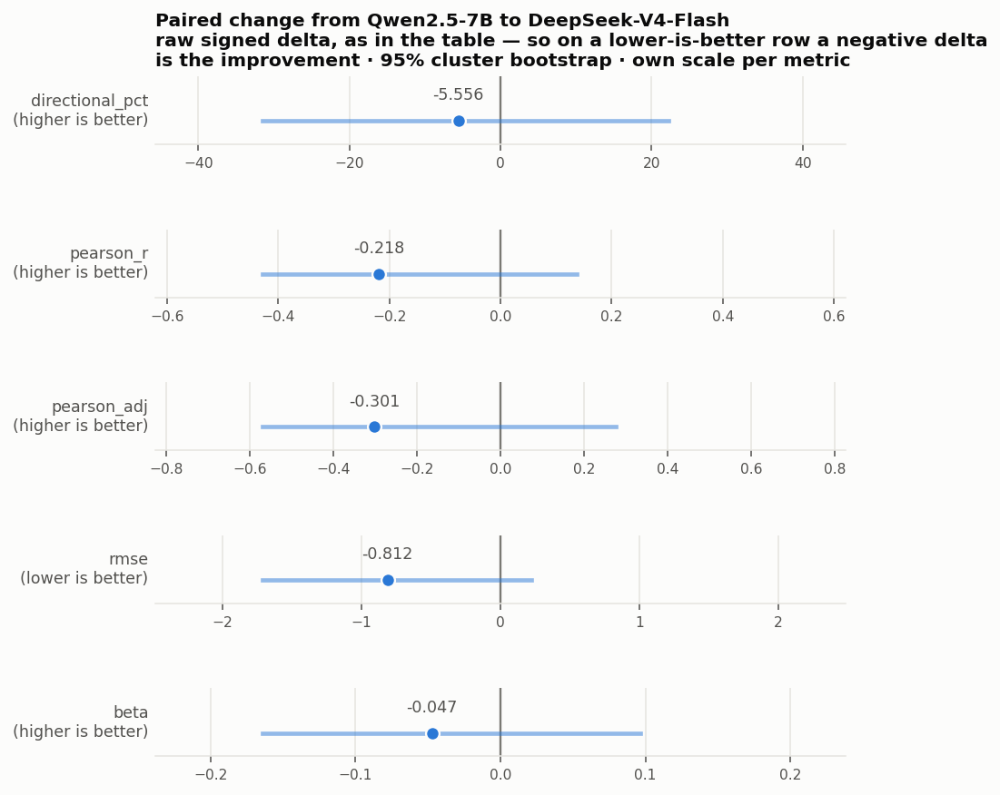
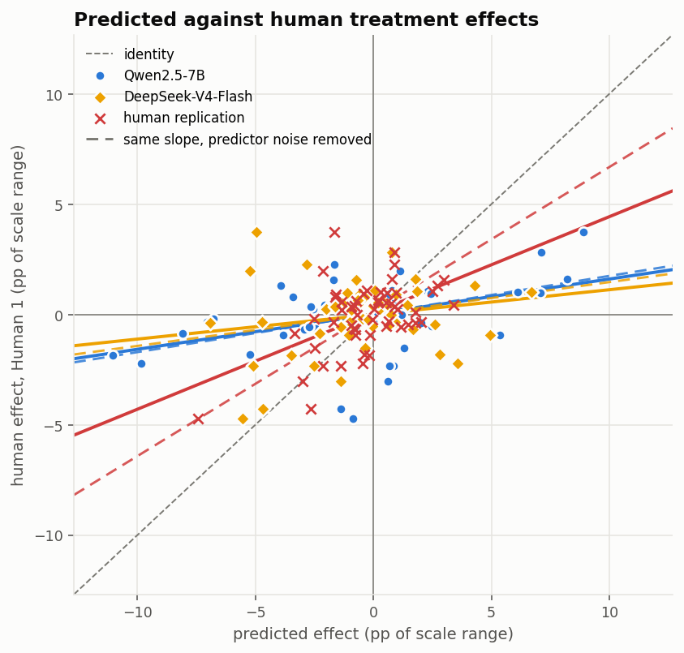
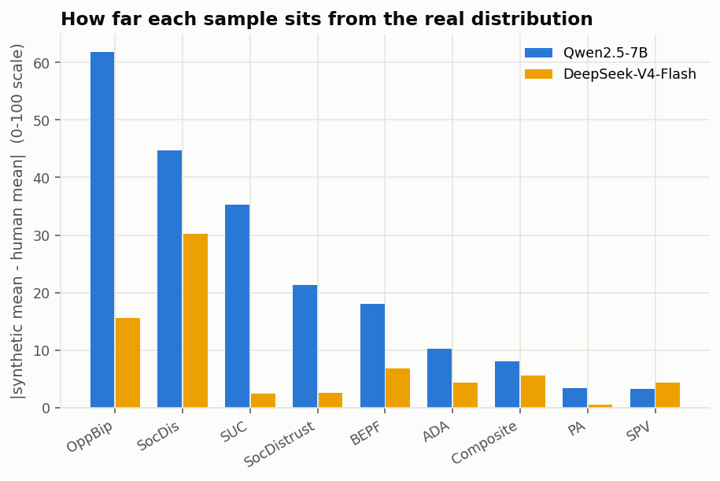

# Does a bigger base model sample more faithfully?

[← main report](README.md)

Qwen2.5-7B against DeepSeek-V4-Flash, both scored against the same real
responses. Respondents: Qwen2.5-7B: 6,203 · DeepSeek-V4-Flash: 6,203. Both models sampled the *same* profiles
with the same seeds, so the comparison is paired respondent by respondent.

## The leaderboard

| submission | n_pairs | directional_pct | pearson_r | pearson_adj | rmse | alpha | beta | beta_adj |
| --- | --- | --- | --- | --- | --- | --- | --- | --- |
| Qwen2.5-7B | 54 | 61.111 | 0.408 | 0.563 | 3.620 | 0.014 | 0.159 | 0.173 |
| DeepSeek-V4-Flash | 54 | 55.556 | 0.190 | 0.262 | 2.808 | 0.002 | 0.112 | 0.145 |
| Human replication (Human 2) | 54 | 66.667 | 0.514 | 0.709 | 1.682 | 0.068 | 0.436 | 0.655 |
| Baseline: no effect | 54 | 50.000 |  |  | 1.537 | -0.059 | 0.000 |  |
| Baseline: all positive | 54 | 55.556 |  |  | 1.865 | -0.029 | -0.029 |  |

Read every row against the human replication, not against 1.0: a real
replication of this size is the ceiling the pipeline is chasing.

## Did it improve? The paired answer

Both models answered the same instrument about the same interventions and
are scored against the same reference, so their errors move together. Each
bootstrap draw resamples one set of intervention clusters and rescores
*both* — which estimates the difference far more precisely than either
score, and is why this table, not the leaderboard above, is the verdict.

| metric | Qwen2.5-7B | DeepSeek-V4-Flash | delta | delta_lo | delta_hi | p_contender_better |
| --- | --- | --- | --- | --- | --- | --- |
| directional_pct | 61.111 | 55.556 | -5.556 | -31.481 | 22.222 | 0.318 |
| pearson_r | 0.408 | 0.190 | -0.218 | -0.428 | 0.137 | 0.102 |
| pearson_adj | 0.563 | 0.262 | -0.301 | -0.569 | 0.276 | 0.101 |
| rmse | 3.620 | 2.808 | -0.812 | -1.711 | 0.220 | 0.944 |
| beta | 0.159 | 0.112 | -0.047 | -0.164 | 0.096 | 0.258 |

Clusters resampled: 6.

- **directional_pct**: -5.556 [-31.481, +22.222] — not settled: the resamples do not agree on a direction.
- **pearson_r**: -0.218 [-0.428, +0.137] — not settled: the resamples do not agree on a direction.
- **pearson_adj**: -0.301 [-0.569, +0.276] — not settled: the resamples do not agree on a direction.
- **rmse**: -0.812 [-1.711, +0.220] — not settled: the resamples do not agree on a direction.
- **beta**: -0.047 [-0.164, +0.096] — not settled: the resamples do not agree on a direction.

## Levels, not just effects

Treatment effects are differences, so a constant bias cancels out of them.
Raw response distributions have no such mercy, and this is where the
Qwen2.5-7B sample failed worst.

Mean absolute level error across outcomes — DeepSeek-V4-Flash 8.0 · Qwen2.5-7B 22.9 points on a 0-100 scale.

| model | outcome | mean_human | mean_synthetic | level_error | variance_ratio | ovl | w1 |
| --- | --- | --- | --- | --- | --- | --- | --- |
| DeepSeek-V4-Flash | ADA | 27.48 | 23.10 | 4.37 | 1.27 | 0.71 | 5.99 |
| Qwen2.5-7B | ADA | 27.48 | 17.29 | 10.19 | 1.09 | 0.56 | 10.88 |
| DeepSeek-V4-Flash | BEPF | 52.05 | 45.24 | 6.81 | 1.18 | 0.85 | 6.97 |
| Qwen2.5-7B | BEPF | 52.05 | 33.97 | 18.09 | 1.38 | 0.65 | 18.14 |
| DeepSeek-V4-Flash | Composite | 39.22 | 44.77 | 5.55 | 0.88 | 0.80 | 5.61 |
| Qwen2.5-7B | Composite | 39.22 | 47.26 | 8.04 | 0.49 | 0.62 | 8.49 |
| DeepSeek-V4-Flash | OppBip | 21.13 | 36.71 | 15.57 | 2.31 | 0.68 | 15.55 |
| Qwen2.5-7B | OppBip | 21.13 | 82.98 | 61.85 | 1.12 | 0.21 | 61.72 |
| DeepSeek-V4-Flash | PA | 65.81 | 66.34 | 0.54 | 1.41 | 0.81 | 4.18 |
| Qwen2.5-7B | PA | 65.81 | 62.46 | 3.35 | 1.44 | 0.80 | 4.82 |
| DeepSeek-V4-Flash | SPV | 10.79 | 15.10 | 4.31 | 1.31 | 0.61 | 4.36 |
| Qwen2.5-7B | SPV | 10.79 | 14.02 | 3.22 | 1.15 | 0.64 | 3.82 |
| DeepSeek-V4-Flash | SUC | 53.28 | 55.64 | 2.36 | 2.12 | 0.63 | 12.82 |
| Qwen2.5-7B | SUC | 53.28 | 18.06 | 35.22 | 1.22 | 0.37 | 35.16 |
| DeepSeek-V4-Flash | SocDis | 30.61 | 60.80 | 30.19 | 1.29 | 0.56 | 30.14 |
| Qwen2.5-7B | SocDis | 30.61 | 75.39 | 44.78 | 1.05 | 0.42 | 44.69 |
| DeepSeek-V4-Flash | SocDistrust | 52.61 | 55.20 | 2.59 | 1.22 | 0.83 | 4.56 |
| Qwen2.5-7B | SocDistrust | 52.61 | 73.96 | 21.35 | 1.19 | 0.57 | 21.64 |

## Does it condition on who it is supposed to be?

The sharpest failure of the smaller model was demographic flatness: it
wrote a party identity into the transcript and then answered as if it had
not. If scale fixes anything, the *visible* moderators should now beat the
invisible ones — the model can read the first group and cannot read the
second, so a real conditioning effect has to show up as a gap.

| model | run | moderators | n_moderators | pearson_r | directional_pct |
| --- | --- | --- | --- | --- | --- |
| Qwen2.5-7B | qwen25_7b | invisible | 2 | 0.237 | 53.472 |
| Qwen2.5-7B | qwen25_7b | visible | 3 | 0.236 | 56.852 |
| DeepSeek-V4-Flash | v4_flash | invisible | 2 | 0.079 | 50.694 |
| DeepSeek-V4-Flash | v4_flash | visible | 3 | 0.040 | 48.704 |

Subgroup treatment effects are a hard and noisy target, though, so the
cleaner test is whether the model puts partisans in different places at all,
before any intervention. Party is named in every question of this
instrument, so a flat gap has no excuse:

| outcome | human | Qwen2.5-7B | DeepSeek-V4-Flash |
| --- | --- | --- | --- |
| PA | 0.6 | -8.3 | 3.5 |
| ADA | 4.2 | -0.6 | 18.8 |
| SPV | -1.2 | 0.7 | 9.3 |
| SUC | 2.0 | -0.0 | 0.5 |
| OppBip | 6.3 | 1.3 | 17.0 |
| SocDistrust | 1.8 | 1.3 | 7.3 |
| SocDis | -9.1 | -2.4 | 9.5 |
| BEPF | 1.2 | -17.2 | 12.5 |
| Composite | 0.7 | -3.1 | 9.8 |

| model | mean_abs_gap | sd_gap | corr_with_human_gaps | n_outcomes |
| --- | --- | --- | --- | --- |
| Qwen2.5-7B | 3.90 | 6.08 | 0.10 | 9 |
| DeepSeek-V4-Flash | 9.80 | 5.85 | 0.31 | 9 |
| human (Human 1) | 3.02 | 4.29 | 1.00 | 9 |

**The two models fail in opposite directions.** Read `mean_abs_gap` against
the human row: one sample is too flat, the other too stereotyped. A model
answering from a stereotype produces subgroup differences that are too large
and too clean; a model ignoring its assigned identity produces almost none.
The benchmark's diagnostics are built to catch the first, and the second is
the more damaging of the two for subgroup estimates — so moving from one to
the other is not simply progress.

## What the samplers did

| model | hf_id | respondents_per_hour | rejection_rate | structured_fallbacks | forced_defaults | gpus |
| --- | --- | --- | --- | --- | --- | --- |
| Qwen2.5-7B | Qwen/Qwen2.5-7B | 1678.1000 | 0.0633 | 2689 | 0 | 1 |
| DeepSeek-V4-Flash | deepseek-ai/DeepSeek-V4-Flash-Base | 1205.1000 | 0.0508 | 195 | 0 | 4 |

