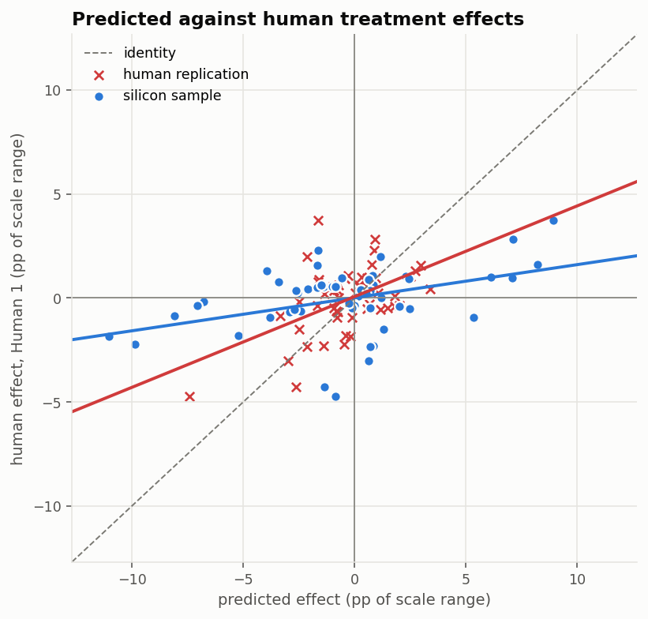
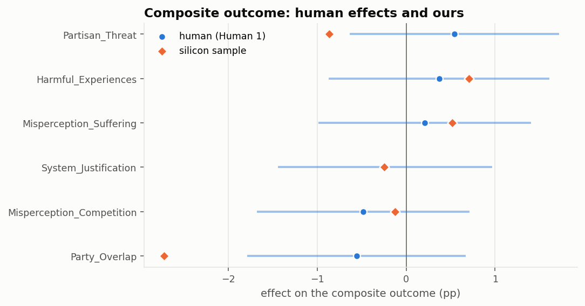

# Does silicon sampling work? A check against real data

The Pfänder megastudy publishes no human data, so nothing in that submission can
be verified. Voelkel et al. (2024) — the Strengthening Democracy Challenge — is
the same shape and publishes **35,252 participant-level responses**. Running the
identical pipeline over it and scoring it with the benchmark's own metrics is the
closest available estimate of how the approach actually performs.

**6,203 synthetic respondents** across 7 arms, sampled twice — once with
Qwen2.5-7B and once with **DeepSeek-V4-Flash-Base (~290 B)** — and scored against
**Human 1** (6,259 real respondents), with **Human 2** (6,242) predicting Human 1
as the yardstick. Both models answered the same profiles with the same seeds, so
the two samples are paired respondent by respondent.

## The result

| submission | n_pairs | directional_pct | pearson_r | pearson_adj | rmse | alpha | beta |
| --- | --- | --- | --- | --- | --- | --- | --- |
| Silicon sample (Qwen2.5-7B) | 54 | 61.111 | 0.408 | 0.563 | 3.620 | 0.014 | 0.159 |
| Silicon sample (DeepSeek-V4-Flash) | 54 | 55.556 | 0.190 | 0.262 | 2.808 | 0.002 | 0.112 |
| Human replication (Human 2) | 54 | 66.667 | 0.514 | 0.709 | 1.682 | 0.068 | 0.436 |
| Baseline: no effect | 54 | 50.000 |  |  | 1.537 | -0.059 | 0.000 |
| Baseline: all positive | 54 | 55.556 |  |  | 1.865 | -0.029 | -0.029 |

Read every number against the human replication row, not against 1.0.

### The 40x bigger model did not recover effects better

**[Full paired comparison →](05_model_comparison.md)**. In one line: scaling from
7 B to ~290 B parameters bought a **much more realistic sample** and **no better
prediction of which interventions work**.

| | Qwen2.5-7B | DeepSeek-V4-Flash | paired verdict |
| --- | --- | --- | --- |
| mean absolute level error | 22.9 pp | **8.0 pp** | large improvement |
| effect over-spread vs truth | 2.6x | **1.7x** | improvement |
| RMSE | 3.620 | **2.808** | -0.81 [-1.71, +0.22], p(better) 0.94 |
| pearson r | **0.408** | 0.190 | -0.22 [-0.43, +0.14], p(better) 0.10 |
| directional % | **61.1** | 55.6 | -5.6 [-31.5, +22.2], p(better) 0.32 |
| partisan gap, control arm | 3.9 pp (human 3.0) | 9.8 pp | flat -> stereotyped |

None of the effect-recovery deltas clears its interval, so the correct reading is
"no improvement, and possibly a regression" rather than a demonstrated regression.
What *is* clear is the direction of travel on levels: the bigger model puts
respondents in roughly the right place on scales where the smaller one was 20-60
points out, and it stopped being demographically flat — overshooting instead.

The improved RMSE is mostly the reduced exaggeration, not better ranking: a
predictor whose effects shrink toward the truth's scale gains on squared error
even when its ordering gets worse, and here the ordering did get worse.

**The ordering is partly right.** A real replication of this size scores
**r = 0.51**; our sample scores **r = 0.41** [0.11, 0.55] —
roughly 79% of what a fresh human sample achieves. Directional
agreement is **61%** against the replication's
67% and a no-information floor of 50%.

**The magnitudes are not.** Our effects are **2.6 times too spread out**
(SD 3.98 pp against the real 1.55 pp), and the calibration slope is
**β = 0.16** — the human effect is about a sixth of what we predict. Our RMSE is
**3.62 pp** [2.37, 4.65], against a real replication's 1.68 pp [1.22, 2.08]
and 1.54 pp for predicting no effect at all.

**Read the RMSE column carefully — the zero-predictor is a strong baseline here,
not a weak one.** The true effects in these six arms are barely larger than the
noise in a half sample of this size: true effect SD is **1.12 pp** against a
per-effect standard error of **1.07 pp**. When signal and noise are that close,
shrinking everything to zero is close to optimal, and even a *perfect but noisy*
predictor can barely beat it. The human replication does not clearly beat it
either — its 1.68 pp sits above the baseline's 1.54, and its interval
[1.22, 2.08] contains it, so the two are indistinguishable. So "worse than
predicting nothing" is not the damning line it looks like; it is a bar almost
nobody clears in this study.

What *is* damning is the size of the gap. Our 3.62 pp is roughly
2.4× the baseline and 2.2× the replication, with an interval
[2.37, 4.65] that excludes both. That excess is not noise; it is the over-spread.

That is not a small-sample artefact. Correcting the slope for sampling noise in
the predictions barely moves it (β_adj = 0.17, against the replication's
0.66), so the exaggeration is not noise in our synthetic sample — the model
genuinely believes these messages do several times more than they do. A real
replication's slope is flattened mostly *by* its own noise; ours is flat because
it is wrong.

**What that means for a submission.** Rank-order information is real and worth
having; predicted effect sizes are not usable as levels. On a leaderboard that
scores correlation this sample would look respectable, and on one that scores
RMSE or calibration it would lose to a constant zero.

### How to read that figure

**The identity line is the target, but a slope of 1 is not what a good predictor
produces here.** Both axes are noisy estimates of the same unobservable truth, and
regressing one noisy quantity on another attenuates the slope toward zero:
conditioning on a large predicted effect selects cases where the predictor's noise
happened to land positive, so the truth behind them — and hence the human
measurement of it — is smaller. The fitted slope is the *reliability* of the
x-axis, `var(true) / (var(true) + var(noise))`, not 1.

That matters because **attenuation depends only on the x-axis, which is different
for each row**:

| | x-axis reliability | raw slope | noise removed |
| --- | --- | --- | --- |
| silicon sample | 0.92 | 0.16 | **0.17** |
| human replication | 0.67 | 0.44 | **0.66** |

The human replication's effects are 33% sampling noise, ours only 8%. So the
solid red line is dragged flat by something that barely touches the solid blue
one, and comparing the two by eye understates the gap — it reads as a
2.7x difference when the real one is 3.8x. The dashed lines remove each
predictor's own noise: the red one springs up near identity, which is where an
unbiased-but-noisy predictor belongs, while the blue one barely moves.

**Why not simply plot against the true effects, where the ceiling would be
obvious?** Because they are not observable. Every candidate x-axis is itself an
estimate: the half sample used here is 53% reliable, and even the *full* human
sample is only 69%. There is no noise-free axis to plot against, which is why
the correction is applied to the slope rather than to the data.

## The levels are wrong, though the spread is not

Treatment effects are differences, so a constant bias cancels out of them. The
raw response distributions have no such mercy, and they show something the effect
metrics cannot: **the synthetic respondents sit in the wrong place on several
scales entirely.**

| outcome | mean_human | mean_synthetic | sd_human | sd_synthetic | variance_ratio | ovl | w1 | level_error |
| --- | --- | --- | --- | --- | --- | --- | --- | --- |
| OppBip | 21.1 | 83.0 | 21.8 | 23.1 | 1.1 | 0.2 | 61.7 | 61.9 |
| SocDis | 30.6 | 75.4 | 27.6 | 28.2 | 1.0 | 0.4 | 44.7 | 44.8 |
| SUC | 53.3 | 18.1 | 23.6 | 25.8 | 1.2 | 0.4 | 35.2 | 35.2 |
| SocDistrust | 52.6 | 74.0 | 27.7 | 30.2 | 1.2 | 0.6 | 21.6 | 21.4 |
| BEPF | 52.1 | 34.0 | 21.4 | 25.1 | 1.4 | 0.6 | 18.1 | 18.1 |
| ADA | 27.5 | 17.3 | 23.3 | 24.3 | 1.1 | 0.6 | 10.9 | 10.2 |
| Composite | 39.2 | 47.3 | 12.7 | 8.8 | 0.5 | 0.6 | 8.5 | 8.0 |
| PA | 65.8 | 62.5 | 20.1 | 24.0 | 1.4 | 0.8 | 4.8 | 3.3 |
| SPV | 10.8 | 14.0 | 20.0 | 21.5 | 1.2 | 0.6 | 3.8 | 3.2 |

Mean absolute level error across the nine outcomes is **23 points on a
0-100 scale**. Three are worth naming. Opposition to bipartisan cooperation runs
21 in the real sample and 83 in ours — real Americans in this sample support
bipartisanship and our synthetic ones oppose it. Social distance is 31 against
75. Support for undemocratic candidates goes the other way, 53 against 18.

The *shape* is better than the position: the mean variance ratio is
**1.13** (1 is perfect), so within a condition the synthetic responses are about
as spread out as the real ones. This sample is not the degenerate,
everyone-answers-50 failure. It is a sample of people who disagree with each
other by roughly the right amount, about the wrong thing.

## What the pieces say

- **[Effects](01_effects.md)** — arm by arm, outcome by outcome, ours against theirs.
- **[Distributions](02_distributions.md)** — whether the spread is right, not just the mean.
- **[Subgroups](03_subgroups.md)** — where the Pfänder finding repeats. The three
  moderators the model *could* see (gender, race, party) predict its subgroup
  effects no better than the two it could not (age, education): pooled r of
  0.26 against 0.24. Even with the respondent's party written into every
  question — this instrument asks about "Republicans" and "Democrats" by name —
  the model is not conditioning on who it is supposed to be.
- **[Diagnostics](04_diagnostics.md)** — what the sampler did.
- **[Model comparison](05_model_comparison.md)** — Qwen2.5-7B against
  DeepSeek-V4-Flash-Base, cluster-paired so the difference carries an interval.

## What this can and cannot tell us about Pfänder

Three limits, all structural:

1. **Different topic and year.** Voelkel is democratic norms in 2022, Pfänder is
   climate scientists in 2026. A 2022 instrument also sits inside the model's
   training window in a way a 2026 one does not — the model may know how this
   study came out.
2. **Six intervention clusters.** The pure-text rule left 6 of 27 arms, so the
   cluster bootstrap resamples six things and every interval is wide. The human
   replication row suffers the same thinness, which is why it, and not the
   absolute value, is the comparison.
3. **A subset the paper never reports.** Dropping the non-textual arms means our
   human reference is not the study's headline result. Internally consistent, but
   not a replication of Voelkel et al.
